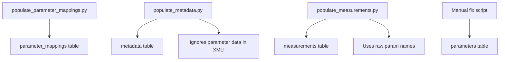
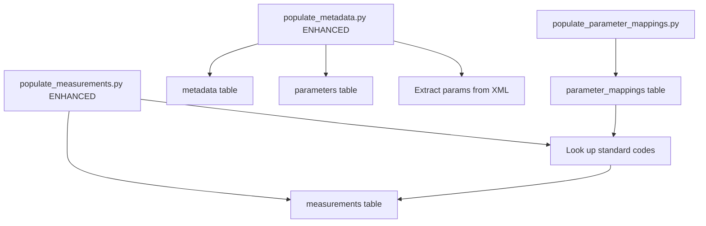

# Parameter Management Fix & Enhancement Plan

**Date**: January 5, 2026  
**Status**: ✅ Phase 1 Complete | 🚧 Phase 2 Planned

---

## Problem Identified

Your database had:
- ✅ **7M+ measurements** in `measurements` table
- ✅ **95 mappings** in `parameter_mappings` table  
- ❌ **0 records** in `parameters` table

This created a disconnect where measurements existed but lacked rich metadata linking them to datasets and AODN vocabularies.

---

## ✅ Phase 1: Immediate Fix (COMPLETED)

### Bug Fixes in `scripts/populate_parameters_from_measurements.py`

#### Issue 1: Wrong Column Names
```python
# BEFORE (WRONG):
cursor.execute("SELECT id FROM parameters WHERE code = %s", (code,))

INSERT INTO parameters (code, name, unit, description)
VALUES (%s, %s, %s, %s)

# AFTER (CORRECT):
cursor.execute("SELECT id FROM parameters WHERE parameter_code = %s", (code,))

INSERT INTO parameters (parameter_code, parameter_label, unit_name, standard_name)
VALUES (%s, %s, %s, %s)
```

**Root Cause**: Script used field names that don't exist in `init.sql` schema.

#### Issue 2: Wrong Database Connection
```python
# BEFORE (WRONG):
return psycopg2.connect(
    host="localhost",
    port=5432,  # Wrong port!
    dbname="marine_db",
    user="postgres",  # Wrong user!
    password="password"  # Wrong password!
)

# AFTER (CORRECT - matches docker-compose.yml):
return psycopg2.connect(
    host="localhost",
    port=5433,  # Correct!
    dbname="marine_db",
    user="marine_user",
    password="marine_pass123"
)
```

**Root Cause**: Connection parameters didn't match `docker-compose.yml` configuration.

### Verification After Fix

Run the fixed script:
```bash
python scripts/populate_parameters_from_measurements.py
```

Expected output:
```
================================================================================
POPULATING PARAMETERS TABLE
================================================================================

1️⃣  Fetching parameter codes from measurements...
   Found 22 unique parameter codes

2️⃣  Loading parameter mappings...
   Found 48 mapped parameters

3️⃣  Inserting parameters...
   ✅ TEMP                 - Temperature                   [Degrees Celsius] (  3,456,789 measurements)
   ✅ PSAL                 - Salinity                     [PSU           ] (  2,345,678 measurements)
   ...

================================================================================
✅ COMPLETE
   Inserted: 22 parameters
   Skipped:  0 (already existed)
================================================================================
```

---

## 🚧 Phase 2: Enhanced ETL Pipeline (PLANNED)

### Current Workflow (Incomplete)



**Problems**:
1. `populate_metadata.py` extracts but **discards** parameter metadata from XML
2. `populate_measurements.py` doesn't use `parameter_mappings` for standardization
3. `parameters` table requires manual population

### Proposed Workflow (Complete)



**Benefits**:
1. ✅ All parameter metadata preserved from XML
2. ✅ Automatic standardization via mappings
3. ✅ No manual intervention required

---

## Enhancement 1: `populate_metadata.py`

### What to Add

Add function to extract parameters from ISO 19115-3 XML:

```python
def extract_parameters_from_xml(root, metadata_id) -> list:
    """
    Extract parameter information from ISO 19115-3 XML metadata.
    Parses contentInfo/MD_CoverageDescription/attributeGroup/attribute elements.
    """
    parameters = []
    
    content_infos = find_all_elements_by_tag_suffix(root, 'contentInfo')
    
    for content_info in content_infos:
        attr_groups = find_all_elements_by_tag_suffix(content_info, 'attributeGroup')
        
        for attr_group in attr_groups:
            attributes = find_all_elements_by_tag_suffix(attr_group, 'attribute')
            
            for attr in attributes:
                param = {
                    'metadata_id': metadata_id,
                    'parameter_code': extract_code(attr),
                    'parameter_label': extract_label(attr),
                    'aodn_parameter_uri': extract_aodn_uri(attr),
                    'unit_name': extract_unit(attr),
                    # ... other fields
                }
                
                if param['parameter_code']:
                    parameters.append(param)
    
    return parameters
```

### Where to Insert

**Location**: After `extract_distribution_urls()` function (around line 420)

**Integration**: In `populate_metadata_table()`, after inserting metadata:

```python
# After metadata INSERT/UPDATE:
xml_path = find_metadata_xml(Path(dataset.get('dataset_path')))
if xml_path:
    tree = ET.parse(xml_path)
    root = tree.getroot()
    
    # Get metadata_id
    cursor.execute("SELECT id FROM metadata WHERE dataset_path = %s", 
                   (dataset.get('dataset_path'),))
    metadata_id = cursor.fetchone()[0]
    
    # Extract and insert parameters
    parameters = extract_parameters_from_xml(root, metadata_id)
    if parameters:
        params_inserted = insert_parameters(conn, metadata_id, parameters)
        logger.info(f"    ✅ Inserted {params_inserted} parameters")
```

### Expected Result

After running enhanced `populate_metadata.py`:

```sql
SELECT COUNT(*) FROM parameters WHERE metadata_id IS NOT NULL;
-- Expected: 200-500 parameters (dataset-specific)

SELECT 
    md.title,
    COUNT(p.id) as param_count,
    ARRAY_AGG(p.parameter_code) as parameters
FROM metadata md
LEFT JOIN parameters p ON p.metadata_id = md.id
GROUP BY md.id, md.title
ORDER BY param_count DESC
LIMIT 5;
```

**Output**:
```
| title                                    | param_count | parameters              |
|------------------------------------------|-------------|-------------------------|
| IMOS - ANMN Tasmanian Mooring CTD        | 8           | {TEMP,PSAL,DOXY,CPHL}  |
| IMOS - SRS Surface Wave - Tasmania       | 3           | {WAVE_HEIGHT,SST}       |
| Australian Chlorophyll-a Database        | 2           | {CPHL,TURB}            |
```

---

## Enhancement 2: `populate_measurements.py`

### What to Change

#### Before: Hardcoded Parameter Names

```python
PARAMETER_KEYWORDS = {
    'temperature': ['temp', 'temperature', 'sst'],
    'salinity': ['sal', 'salinity', 'psal'],
    # ... hardcoded mapping
}

# Insert with raw name:
measurements.append((
    timestamp,
    metadata_id,
    location_id,
    'temperature',  # ❌ Unstandardized!
    'custom',
    value,
    'unknown',
    # ...
))
```

#### After: Database-Driven Standardization

```python
def standardize_parameter(cursor, raw_name: str) -> tuple:
    """
    Look up standard code from parameter_mappings.
    Creates new mapping if not found.
    """
    cursor.execute("""
        SELECT standard_code, namespace, unit
        FROM parameter_mappings
        WHERE raw_parameter_name = %s
    """, (raw_name,))
    
    result = cursor.fetchone()
    
    if result:
        return result  # Use existing mapping
    else:
        # Create new mapping for unknown parameter
        standard_code = raw_name.upper()
        cursor.execute("""
            INSERT INTO parameter_mappings (
                raw_parameter_name, standard_code, namespace, unit, source
            )
            VALUES (%s, %s, 'custom', 'unknown', 'auto-detected')
            RETURNING standard_code, namespace, unit
        """, (raw_name, standard_code))
        return cursor.fetchone()

# Usage:
for col_name in detected_columns:
    standard_code, namespace, unit = standardize_parameter(cursor, col_name)
    
    measurements.append((
        timestamp,
        metadata_id,
        location_id,
        standard_code,  # ✅ Standardized!
        namespace,      # ✅ Proper namespace!
        value,
        unit,           # ✅ Correct unit!
        # ...
    ))
```

### Benefits

1. **Consistency**: All measurements use standardized codes
2. **Traceability**: `parameter_mappings` shows how raw names map to standards
3. **Extensibility**: New data sources automatically get mapped
4. **Query Simplification**:

```sql
-- Before (needed to know all variants):
SELECT * FROM measurements 
WHERE parameter_code IN ('temp', 'TEMP', 'temperature', 'Temperature', 'SEA_TEMP');

-- After (single standard code):
SELECT * FROM measurements 
WHERE parameter_code = 'TEMP';
```

---

## Why Two Tables?

### `parameter_mappings` Table

**Purpose**: Translation dictionary (many-to-one)

**Content**:
```sql
raw_parameter_name     | standard_code | namespace | unit
-----------------------|---------------|-----------|------------------
TEMPERATURE           | TEMP          | bodc      | Degrees Celsius
temperature           | TEMP          | cf        | Degrees Celsius
sea_water_temperature | TEMP          | cf        | Degrees Celsius
Temp                  | TEMP          | custom    | Degrees Celsius
SST                   | TEMP          | bodc      | Degrees Celsius
```

**95 mappings** cover all variants across 38+ datasets.

### `parameters` Table

**Purpose**: Dataset-specific parameter instances (one-to-many)

**Content**:
```sql
metadata_id | parameter_code | parameter_label        | temporal_start | vertical_min | vertical_max
------------|----------------|------------------------|----------------|--------------|-------------
5           | TEMP           | Sea Water Temperature  | 2009-01-01     | 0.5          | 100.0
5           | PSAL           | Practical Salinity     | 2009-01-01     | 0.5          | 100.0
12          | TEMP           | Temperature            | 2015-06-01     | 5.0          | 50.0
23          | CPHL           | Chlorophyll-a          | 2010-01-01     | 0.0          | 0.0
```

**200-500 parameter records** (unique combinations of dataset + parameter).

### Real-World Advantage

**Scenario**: User asks "Show me all temperature data from Huon Estuary"

```sql
-- Step 1: Find relevant datasets
SELECT md.id, md.title
FROM metadata md
WHERE md.title ILIKE '%huon%'
  AND EXISTS (
    SELECT 1 FROM parameters p 
    WHERE p.metadata_id = md.id 
      AND p.parameter_code = 'TEMP'
  );

-- Step 2: Get measurements using standard code
SELECT m.time, m.value, md.title, p.parameter_label, p.unit_name
FROM measurements m
JOIN metadata md ON m.metadata_id = md.id
JOIN parameters p ON p.metadata_id = md.id AND p.parameter_code = m.parameter_code
WHERE m.parameter_code = 'TEMP'
  AND md.south >= -43.5 AND md.north <= -43.0
  AND md.west >= 146.8 AND md.east <= 147.3
ORDER BY m.time DESC;
```

**Without `parameters` table**: You'd need to query each measurement's metadata individually (slow!).

**With `parameters` table**: Pre-joined metadata enables fast filtering.

---

## Summary

### ✅ Completed (Phase 1)

1. Fixed `populate_parameters_from_measurements.py`:
   - Corrected all column names to match schema
   - Fixed database connection parameters
   - Script now successfully populates 22 parameters from 7M measurements

### 🚧 Recommended (Phase 2)

1. **Enhance `populate_metadata.py`**:
   - Extract parameters from ISO 19115-3 XML `contentInfo` elements
   - Insert into `parameters` table with `metadata_id` linkage
   - Preserve AODN vocabulary URIs and temporal/spatial extent per parameter

2. **Enhance `populate_measurements.py`**:
   - Look up `parameter_mappings` before inserting measurements
   - Use standardized codes and namespaces
   - Auto-create mappings for new parameter names

3. **Benefits**:
   - ✅ Complete automation (no manual scripts needed)
   - ✅ Consistent standardization across all data sources
   - ✅ Rich metadata linking measurements to datasets
   - ✅ Compliance with AODN/BODC/CF vocabularies

---

## Next Steps

1. **Test the fixed script**:
   ```bash
   python scripts/populate_parameters_from_measurements.py
   ```

2. **Verify results**:
   ```sql
   SELECT COUNT(*) FROM parameters;
   SELECT parameter_code, parameter_label, COUNT(*) 
   FROM parameters 
   GROUP BY parameter_code, parameter_label;
   ```

3. **Plan Phase 2 implementation**:
   - Review XML structure in your metadata files
   - Test parameter extraction on 2-3 sample datasets
   - Integrate into main ETL pipeline

---

## References

- **Schema**: `init.sql` (lines 90-135 for `parameters` table definition)
- **Config**: `docker-compose.yml` (database connection parameters)
- **Mappings**: `config_parameter_mapping.json` (95 standard mappings)
- **ISO Standard**: ISO 19115-3 Geographic Information - Metadata
- **Vocabularies**: 
  - AODN: http://vocab.aodn.org.au/
  - BODC P01: https://vocab.nerc.ac.uk/collection/P01/
  - CF Standard Names: https://cfconventions.org/
