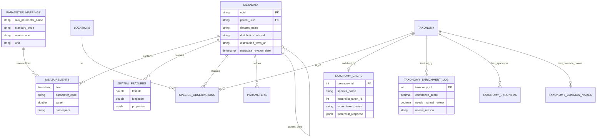

# Marine Data Platform - Database Schema Documentation

This document describes the database schema designed for the Tasmanian Climate & Marine Data Platform. The system utilizes **PostgreSQL 18+** with **TimescaleDB** (for time-series).

## High-Level Architecture

The schema is organized around a central **Metadata** registry, to which all types of data are linked:
1.  **Time-Series Data**: High-frequency sensor readings (Hypertable).
2.  **Spatial Features**: Polygons, lines, and non-time-series geometries (pure PostgreSQL).
3.  **Biological Observations**: Species occurrences and taxonomy.
4.  **Parameter Mappings**: Standardized parameter name mappings.
5.  **Taxonomy Enrichment**: ⭐ **NEW** - External API cache (iNaturalist, WoRMS, GBIF).

---

## 0. Parameter Standardization

### `parameter_mappings` ⭐ NEW

Maps raw parameter names from data files to standardized BODC/CF codes. This table **replaces** the previous `config_parameter_mapping.json` file, making parameter management dynamic and database-driven.

#### DDL

```sql
CREATE TABLE parameter_mappings (
    id SERIAL PRIMARY KEY,
    raw_parameter_name TEXT UNIQUE NOT NULL,
    standard_code TEXT NOT NULL,
    namespace TEXT NOT NULL CHECK (namespace IN ('bodc', 'cf', 'custom')),
    unit TEXT NOT NULL,
    description TEXT,
    source TEXT DEFAULT 'system',  -- 'system' or 'user'
    created_at TIMESTAMP DEFAULT NOW(),
    updated_at TIMESTAMP DEFAULT NOW()
);

CREATE INDEX idx_param_mappings_raw ON parameter_mappings(raw_parameter_name);
CREATE INDEX idx_param_mappings_code ON parameter_mappings(standard_code);
CREATE INDEX idx_param_mappings_namespace ON parameter_mappings(namespace);
```

#### Key Fields

- **`raw_parameter_name`**: The original column name from CSV/NetCDF files (e.g., `"TEMPERATURE"`, `"SEA_WATER_TEMP"`)
- **`standard_code`**: Standardized code used in `measurements` table (e.g., `"TEMP"`, `"PSAL"`)
- **`namespace`**: 
  - `bodc` = British Oceanographic Data Centre P01 codes
  - `cf` = Climate & Forecast convention standard names
  - `custom` = User-defined or unmapped parameters
- **`unit`**: Physical unit (e.g., `"Degrees Celsius"`, `"PSS-78"`)
- **`source`**: 
  - `system` = Pre-populated by `init.sql`
  - `user` = Added manually via SQL or web UI

#### Example Data

| raw_parameter_name | standard_code | namespace | unit | description |
|--------------------|---------------|-----------|------|-------------|
| TEMP | TEMP | bodc | Degrees Celsius | Sea water temperature |
| TEMPERATURE | TEMP | bodc | Degrees Celsius | Sea water temperature |
| SEA_WATER_TEMPERATURE | TEMP | cf | Degrees Celsius | CF standard name |
| CPHL | CPHL | bodc | mg/m3 | Chlorophyll-a concentration |
| CHLOROPHYLL_A | CPHL | bodc | mg/m3 | Chlorophyll-a |
| PSAL | PSAL | bodc | PSS-78 | Practical salinity |

#### Usage in ETL

The ETL script `populate_measurements_v2.py` queries this table to normalize parameter names:

```python
# ETL logic (simplified)
raw_name = csv_column_name.upper()  # "TEMPERATURE"
mapping = db.query("SELECT * FROM parameter_mappings WHERE raw_parameter_name = %s", [raw_name])
if mapping:
    standard_code = mapping['standard_code']  # "TEMP"
    namespace = mapping['namespace']          # "bodc"
    unit = mapping['unit']                    # "Degrees Celsius"
else:
    # Fallback to custom namespace
    standard_code = raw_name
    namespace = 'custom'
```

#### Adding Custom Mappings

```sql
-- Add a new parameter mapping
INSERT INTO parameter_mappings (raw_parameter_name, standard_code, namespace, unit, source)
VALUES ('MY_CUSTOM_TEMP', 'TEMP', 'custom', 'Degrees Celsius', 'user');

-- View all mappings
SELECT raw_parameter_name, standard_code, namespace, unit 
FROM parameter_mappings 
ORDER BY namespace, standard_code;

-- Find all temperature variants
SELECT * FROM parameter_mappings WHERE standard_code = 'TEMP';
```

---

## 1. Core Registry

### `metadata` ⭐ ENHANCED v4.0
The central registry for all datasets (AODN and future non-AODN sources). **Now with 34 fields** extracted from ISO 19115-3 XML metadata.

#### DDL

```sql
CREATE TABLE metadata (
    id SERIAL PRIMARY KEY,
    uuid TEXT UNIQUE NOT NULL,
    parent_uuid TEXT,  -- ⭐ NEW: Links child datasets to parent collections
    title TEXT NOT NULL,
    abstract TEXT,
    credit TEXT,  -- ⭐ ENHANCED: Multiple credits concatenated with '; '
    status TEXT,  -- onGoing, completed, etc.
    topic_category TEXT,
    
    -- ⭐ ENHANCED: Temporal metadata
    metadata_creation_date TIMESTAMP,
    metadata_revision_date TIMESTAMP,  -- ⭐ NEW: Last metadata update
    citation_date TIMESTAMP,
    
    -- Metadata standards
    language TEXT DEFAULT 'eng',
    character_set TEXT DEFAULT 'utf8',
    
    -- Spatial extent (bounding box)
    west DECIMAL(10,6),
    east DECIMAL(10,6),
    south DECIMAL(10,6),
    north DECIMAL(10,6),
    
    -- Temporal extent
    time_start DATE,
    time_end DATE,
    
    -- Vertical extent
    vertical_min DECIMAL(6,2),
    vertical_max DECIMAL(6,2),
    vertical_crs TEXT,
    
    -- Data provenance
    lineage TEXT,  -- ⭐ ENHANCED: Processing history
    supplemental_info TEXT,
    use_limitation TEXT,
    
    -- ⭐ NEW: Distribution URLs
    license_url TEXT,
    distribution_wfs_url TEXT,  -- OGC Web Feature Service
    distribution_wms_url TEXT,  -- OGC Web Map Service
    distribution_portal_url TEXT,  -- Data portal
    distribution_publication_url TEXT,  -- DOI/publication
    
    -- Dataset file paths
    dataset_name TEXT,
    dataset_path TEXT UNIQUE,
    
    -- Audit trail
    extracted_at TIMESTAMP DEFAULT CURRENT_TIMESTAMP,
    date_created DATE
);

CREATE INDEX idx_metadata_uuid ON metadata(uuid);
CREATE INDEX idx_metadata_parent_uuid ON metadata(parent_uuid) WHERE parent_uuid IS NOT NULL;
CREATE INDEX idx_metadata_bbox ON metadata(west, east, south, north);
CREATE INDEX idx_metadata_time ON metadata(time_start, time_end);
CREATE INDEX idx_metadata_dataset_path ON metadata(dataset_path);
```

#### Key Fields ⭐ ENHANCED

*   **`id`** (PK): Internal integer ID used for all foreign keys (performance).
*   **`uuid`**: Unique internal identifier. Used to link all related data (measurements, parameters, species observations). Generated by the system on insert.
*   **`parent_uuid`** ✨ **NEW**: Links child datasets to parent collection (e.g., "Chlorophyll 2020" → "Chlorophyll Database 1965-2017")
    - NULL for top-level datasets
    - Enables hierarchical dataset organization
    - Example: 26/38 datasets (68%) have parent relationships
*   **`metadata_creation_date`** ✨ **NEW**: When metadata record was originally created
*   **`metadata_revision_date`** ✨ **NEW**: Last metadata update timestamp (100% populated)
*   **`credit`** ✨ **ENHANCED**: Data contributors/funding sources
    - Multiple credits concatenated with `"; "` separator
    - Example: `"IMOS; CSIRO; University of Tasmania"`
    - 19/38 datasets (50%) have multiple credits
*   **`lineage`** ✨ **ENHANCED**: Full processing history and data provenance from XML
*   **`distribution_wfs_url`** ✨ **NEW**: OGC Web Feature Service endpoint (84% populated)
*   **`distribution_wms_url`** ✨ **NEW**: OGC Web Map Service endpoint (92% populated)
*   **`distribution_portal_url`** ✨ **NEW**: Data portal URL (45% populated)
*   **`distribution_publication_url`** ✨ **NEW**: Associated publication DOI/URL (37% populated)
*   **`license_url`** ✨ **ENHANCED**: Creative Commons or other license URL
*   **`west`, `east`, `south`, `north`**: Bounding box coordinates in decimal degrees (WGS84 / EPSG:4326). Pure PostgreSQL, no PostGIS required.
*   **`dataset_path`**: Relative path to the source folder/file on disk.
*   **`dataset_name`**: Human-readable name of the dataset (e.g., "Australian Chlorophyll-a Database").

### `parameters` (One-to-Many with Metadata)
Describes specific variables available in a dataset (e.g., "Sea Surface Temperature").

#### DDL

```sql
CREATE TABLE parameters (
    id SERIAL PRIMARY KEY,
    metadata_id INTEGER REFERENCES metadata(id) ON DELETE CASCADE,
    parameter_code TEXT NOT NULL,
    parameter_label TEXT,
    standard_name TEXT,
    aodn_parameter_uri TEXT,
    unit_name TEXT,
    unit_uri TEXT,
    content_type TEXT DEFAULT 'physicalMeasurement',
    is_depth BOOLEAN DEFAULT FALSE,
    temporal_start TIMESTAMP,
    temporal_end TIMESTAMP,
    vertical_min NUMERIC(6,2),
    vertical_max NUMERIC(6,2),
    created_at TIMESTAMP DEFAULT NOW(),
    imos_parameter_uri TEXT REFERENCES imos_vocab_parameters(uri),
    imos_unit_uri TEXT REFERENCES imos_vocab_units(uri),
    UNIQUE(metadata_id, parameter_code)
);
```

#### Key Fields

*   **`parameter_code`**: Critical linking field. Matches `parameter_code` in the `measurements` table.
*   **`aodn_parameter_uri`**: Link to the controlled vocabulary definition.

---

## 2. Time-Series Data (TimescaleDB)

### `measurements`
A **Hypertable** partitioned by `time`. Stores physical and chemical sensor data.

#### DDL

```sql
CREATE TABLE measurements (
    time TIMESTAMPTZ NOT NULL,
    data_id BIGSERIAL,
    metadata_id INTEGER REFERENCES metadata(id) ON DELETE CASCADE,
    parameter_code TEXT NOT NULL,
    namespace TEXT NOT NULL DEFAULT 'custom',
    value DOUBLE PRECISION NOT NULL,
    uom TEXT NOT NULL,
    location_qc_flag TEXT,
    uncertainty DOUBLE PRECISION,
    depth_m NUMERIC,
    location_id BIGINT REFERENCES locations(id),
    quality_flag SMALLINT DEFAULT 1
);

-- Convert to hypertable
SELECT create_hypertable('measurements', by_range('time'));

-- Add compression
ALTER TABLE measurements SET (
    timescaledb.compress = true, 
    timescaledb.compress_segmentby = 'parameter_code, namespace'
);
SELECT add_compression_policy('measurements', INTERVAL '7 days');
```

#### Key Fields

*   **`time`**: Timestamp of observation.
*   **`parameter_code`**: The variable being measured (e.g., `TEMP`, `PSAL`, `CPHL`). Links to `parameter_mappings.standard_code`.
*   **`value`**: Numeric value of the measurement.
*   **`uom`**: Unit of measure (e.g., "Degrees Celsius").
*   **`namespace`**: **[Key Field]**
    *   `bodc`: Standardized code (British Oceanographic Data Centre). Use for robust queries.
    *   `custom`: Raw variable name from a file if no standard mapping existed.
    *   `cf`: Climate and Forecast standard name.
*   **`quality_flag`**: Integer (1=Good, 4=Bad/Fail). Always filter by `quality_flag = 1` for analysis.
*   **`metadata_id`**: FK to `metadata`.

> **Note**: This table is optimized for aggregations (daily/hourly means) via TimescaleDB Continuous Aggregates (`measurements_1h`, `measurements_1d`).

---

## 3. Spatial Data (Pure PostgreSQL - No PostGIS)

### `locations`
Distinct survey sites extracted from data files. Uses pure PostgreSQL lat/lon, no PostGIS.

#### DDL

```sql
CREATE TABLE locations (
    id SERIAL PRIMARY KEY,
    location_name text,
    location_type text DEFAULT 'observation_site',
    longitude double precision,
    latitude double precision,
    description text,
    created_at timestamp without time zone DEFAULT now(),
    CONSTRAINT unique_lat_lon UNIQUE (latitude, longitude)
);

CREATE INDEX idx_locations_lat_lon ON locations (latitude, longitude);
CREATE INDEX idx_locations_lat_lon_partial
  ON locations (latitude, longitude)
  WHERE latitude IS NOT NULL AND longitude IS NOT NULL;
```

### `spatial_features`
Stores non-time-series spatial data using pure PostgreSQL (no PostGIS geometries).

#### DDL

```sql
CREATE TABLE spatial_features (
    id SERIAL PRIMARY KEY,
    metadata_id INTEGER REFERENCES metadata(id),
    latitude DOUBLE PRECISION,
    longitude DOUBLE PRECISION,
    properties JSONB
);

CREATE INDEX idx_spatial_features_lat_lon ON spatial_features (latitude, longitude);
CREATE INDEX idx_spatial_features_metadata_id ON spatial_features(metadata_id);
```

#### Key Fields

*   **`latitude`, `longitude`**: Point coordinates in decimal degrees (WGS84).
*   **`properties`**: **[Key Field] JSONB** column containing all feature attributes (e.g., `{"density": "High", "area_ha": 50}`). This allows schema-less storage of diverse shapefile attributes.
*   **`metadata_id`**: FK to `metadata`.

---

## 4. Biological Data

Designed for species abundance and occurrence data.

### `taxonomy`
A normalized registry of species.

#### DDL

```sql
CREATE TABLE taxonomy (
    id SERIAL PRIMARY KEY,
    species_name TEXT UNIQUE NOT NULL,
    common_name TEXT,
    family TEXT,
    phylum TEXT,
    class TEXT,
    "order" TEXT,
    genus TEXT,
    authority TEXT
);
```

#### Key Fields

*   **`species_name`**: Scientific name (Unique).
*   **`common_name`**: Vernacular name.
*   **`family`, `phylum`, `class`**: Taxonomic hierarchy.

### `species_observations`
The core fact table for biology.

#### DDL

```sql
CREATE TABLE species_observations (
    id SERIAL PRIMARY KEY,
    metadata_id INTEGER REFERENCES metadata(id),
    location_id INTEGER REFERENCES locations(id),
    taxonomy_id INTEGER REFERENCES taxonomy(id),
    observation_date TIMESTAMP,
    count_value NUMERIC,
    count_category TEXT,
    depth_m NUMERIC,
    sex TEXT,
    size_class TEXT,
    method TEXT,
    notes TEXT,
    latitude DOUBLE PRECISION,
    longitude DOUBLE PRECISION
);

CREATE INDEX idx_species_obs_lat_lon ON species_observations (latitude, longitude);
CREATE INDEX idx_species_obs_taxonomy ON species_observations(taxonomy_id);
CREATE INDEX idx_species_obs_metadata ON species_observations(metadata_id);
```

#### Key Fields

*   **`taxonomy_id`**: FK to `taxonomy`.
*   **`location_id`**: FK to `locations`.
*   **`count_value`**: Numeric abundance (if available).
*   **`count_category`**: Text description if count is a range (e.g., "DOC" - Dominant).
*   **`latitude`, `longitude`**: **[Key Field]** Denormalized coordinates. While redundant with `locations`, storing them here allows for faster heatmap generation and spatial filtering without joins.

---

## 5. Taxonomy Enrichment ⭐ NEW (January 6, 2026)

External API cache system for enriching species taxonomy from iNaturalist, WoRMS, and GBIF. **564 species** ready for enrichment (100% missing genus, family, common_name).

### `taxonomy_cache`
Primary enrichment data storage with 48 columns of taxonomic metadata.

#### DDL

```sql
CREATE TABLE taxonomy_cache (
    id SERIAL PRIMARY KEY,
    taxonomy_id INTEGER REFERENCES taxonomy(id) ON DELETE CASCADE,
    species_name TEXT UNIQUE NOT NULL,
    
    -- iNaturalist identifiers
    inaturalist_taxon_id INTEGER,
    inaturalist_url TEXT,
    
    -- Taxonomic hierarchy (enriched from API)
    common_name TEXT,
    genus TEXT,
    family TEXT,
    "order" TEXT,
    class TEXT,
    phylum TEXT,
    kingdom TEXT,
    authority TEXT,  -- Taxonomic authority (e.g., "(Linnaeus, 1758)")
    
    -- Taxonomic metadata
    rank TEXT,  -- species, genus, family, order, class, phylum, kingdom
    rank_level INTEGER,  -- Numeric rank (10=species, 20=genus, etc.)
    iconic_taxon_name TEXT,  -- Plantae, Animalia, Chromista, Protozoa, Fungi
    
    -- Conservation & distribution
    conservation_status TEXT,  -- IUCN status if available
    conservation_status_source TEXT,
    introduced BOOLEAN DEFAULT FALSE,  -- Is this an introduced/invasive species?
    endemic BOOLEAN DEFAULT FALSE,  -- Is this endemic to Australia?
    threatened BOOLEAN DEFAULT FALSE,  -- Is this a threatened species?
    
    -- External links
    wikipedia_url TEXT,
    wikipedia_summary TEXT,
    photo_url TEXT,  -- Representative photo URL from iNaturalist
    photo_attribution TEXT,
    
    -- Additional WoRMS data (for marine species)
    worms_aphia_id INTEGER,
    worms_lsid TEXT,  -- Life Science Identifier
    worms_valid_name TEXT,  -- Accepted valid name if this is a synonym
    is_marine BOOLEAN,
    is_brackish BOOLEAN,
    is_freshwater BOOLEAN,
    is_terrestrial BOOLEAN,
    
    -- GBIF data (Global Biodiversity Information Facility)
    gbif_taxon_key INTEGER,
    gbif_canonical_name TEXT,
    
    -- Raw API responses (stored as JSONB for future reference)
    inaturalist_response JSONB,
    worms_response JSONB,
    gbif_response JSONB,
    
    -- Metadata
    data_source TEXT DEFAULT 'inaturalist',  -- Primary source: inaturalist, worms, gbif, manual
    last_updated TIMESTAMP DEFAULT NOW(),
    created_at TIMESTAMP DEFAULT NOW()
);

-- Indexes for taxonomy_cache
CREATE INDEX idx_taxonomy_cache_species ON taxonomy_cache(species_name);
CREATE INDEX idx_taxonomy_cache_taxonomy_id ON taxonomy_cache(taxonomy_id);
CREATE INDEX idx_taxonomy_cache_inat_id ON taxonomy_cache(inaturalist_taxon_id) WHERE inaturalist_taxon_id IS NOT NULL;
CREATE INDEX idx_taxonomy_cache_worms_id ON taxonomy_cache(worms_aphia_id) WHERE worms_aphia_id IS NOT NULL;
CREATE INDEX idx_taxonomy_cache_gbif_key ON taxonomy_cache(gbif_taxon_key) WHERE gbif_taxon_key IS NOT NULL;
CREATE INDEX idx_taxonomy_cache_iconic ON taxonomy_cache(iconic_taxon_name) WHERE iconic_taxon_name IS NOT NULL;
CREATE INDEX idx_taxonomy_cache_rank ON taxonomy_cache(rank);
CREATE INDEX idx_taxonomy_cache_marine ON taxonomy_cache(is_marine) WHERE is_marine = TRUE;
CREATE INDEX idx_taxonomy_cache_source ON taxonomy_cache(data_source);
CREATE INDEX idx_taxonomy_cache_inat_response ON taxonomy_cache USING GIN (inaturalist_response);
```

#### Key Fields

*   **`taxonomy_id`**: FK to `taxonomy` table (the base species list).
*   **`species_name`**: Species scientific name (denormalized for faster lookups).
*   **`inaturalist_taxon_id`**: Primary external ID from iNaturalist API.
*   **`iconic_taxon_name`**: High-level taxonomic group (Plantae, Animalia, Chromista, etc.).
*   **`rank_level`**: Numeric taxonomic rank (10=species, 20=genus, 30=family, etc.).
*   **`conservation_status`**: IUCN status if available from API.
*   **`introduced`, `endemic`, `threatened`**: Boolean flags for conservation management.
*   **`inaturalist_response`, `worms_response`, `gbif_response`**: Full JSONB API responses for future data mining.
*   **`data_source`**: Tracks which API was primary source (inaturalist, worms, gbif, manual).

### `taxonomy_enrichment_log`
Complete audit trail of all API lookups and match decisions.

#### DDL

```sql
CREATE TABLE taxonomy_enrichment_log (
    id SERIAL PRIMARY KEY,
    taxonomy_id INTEGER REFERENCES taxonomy(id) ON DELETE CASCADE,
    species_name TEXT NOT NULL,
    
    -- Search metadata
    search_query TEXT,  -- Actual query sent to API (may differ from species_name)
    api_endpoint TEXT,  -- Which API was called (inaturalist, worms, gbif)
    api_url TEXT,  -- Full URL called
    
    -- Response metadata
    response_status INTEGER,  -- HTTP status code (200, 404, 500, etc.)
    response_time_ms INTEGER,  -- API response time in milliseconds
    matches_found INTEGER DEFAULT 0,  -- Number of results returned
    
    -- Match selection
    taxon_id_selected INTEGER,  -- Which taxon ID was chosen from results
    match_rank INTEGER,  -- Rank of selected match (1=best, 2=second best, etc.)
    confidence_score DECIMAL(3,2),  -- 0.00 to 1.00 (calculated match confidence)
    match_method TEXT,  -- exact, fuzzy, genus_only, manual, etc.
    
    -- Quality flags
    needs_manual_review BOOLEAN DEFAULT FALSE,
    review_reason TEXT,  -- Why this needs review (ambiguous, no_match, low_confidence, etc.)
    reviewed_by TEXT,  -- Username who reviewed this match
    reviewed_at TIMESTAMP,
    review_notes TEXT,
    
    -- Error handling
    error_message TEXT,
    retry_count INTEGER DEFAULT 0,
    
    -- Metadata
    created_at TIMESTAMP DEFAULT NOW()
);

-- Indexes for taxonomy_enrichment_log
CREATE INDEX idx_enrichment_log_taxonomy_id ON taxonomy_enrichment_log(taxonomy_id);
CREATE INDEX idx_enrichment_log_species ON taxonomy_enrichment_log(species_name);
CREATE INDEX idx_enrichment_log_api ON taxonomy_enrichment_log(api_endpoint);
CREATE INDEX idx_enrichment_log_status ON taxonomy_enrichment_log(response_status);
CREATE INDEX idx_enrichment_log_created ON taxonomy_enrichment_log(created_at DESC);
CREATE INDEX idx_enrichment_log_needs_review 
    ON taxonomy_enrichment_log(needs_manual_review) 
    WHERE needs_manual_review = TRUE;
CREATE INDEX idx_enrichment_log_confidence 
    ON taxonomy_enrichment_log(confidence_score) 
    WHERE confidence_score < 0.80;
```

#### Key Fields

*   **`confidence_score`**: Match quality metric (1.0=exact, 0.9+=high, 0.7-0.9=medium, <0.7=low/needs review).
*   **`needs_manual_review`**: Boolean flag for species requiring human verification.
*   **`review_reason`**: Categorizes why review is needed (ambiguous, no_match, low_confidence, multiple_matches, synonym_conflict, unidentified_category).
*   **`response_time_ms`**: API performance tracking for rate limiting decisions.
*   **`matches_found`**: Number of results returned by API (0 = not found, >1 = ambiguous).

### `taxonomy_synonyms`
Tracks synonym relationships discovered during enrichment.

#### DDL

```sql
CREATE TABLE taxonomy_synonyms (
    id SERIAL PRIMARY KEY,
    taxonomy_id INTEGER REFERENCES taxonomy(id) ON DELETE CASCADE,
    synonym_name TEXT NOT NULL,
    accepted_name TEXT NOT NULL,
    status TEXT,  -- synonym, accepted, invalid, misapplied, etc.
    source TEXT,  -- inaturalist, worms, gbif
    source_taxon_id INTEGER,
    notes TEXT,
    created_at TIMESTAMP DEFAULT NOW(),
    UNIQUE(synonym_name, accepted_name)
);

CREATE INDEX idx_taxonomy_synonyms_taxonomy_id ON taxonomy_synonyms(taxonomy_id);
CREATE INDEX idx_taxonomy_synonyms_synonym ON taxonomy_synonyms(synonym_name);
CREATE INDEX idx_taxonomy_synonyms_accepted ON taxonomy_synonyms(accepted_name);
CREATE INDEX idx_taxonomy_synonyms_source ON taxonomy_synonyms(source);
```

#### Key Fields

*   **`synonym_name`**: Alternate scientific name for the species.
*   **`accepted_name`**: Currently accepted valid taxonomic name.
*   **`status`**: Taxonomic status (synonym, accepted, invalid, misapplied, uncertain).
*   **`source`**: Which API provided this synonym relationship.

### `taxonomy_common_names`
Stores multiple common names per species with language and regional variants.

#### DDL

```sql
CREATE TABLE taxonomy_common_names (
    id SERIAL PRIMARY KEY,
    taxonomy_id INTEGER REFERENCES taxonomy(id) ON DELETE CASCADE,
    common_name TEXT NOT NULL,
    language TEXT DEFAULT 'en',  -- ISO 639-1 language code
    locality TEXT,  -- Australia, Tasmania, New Zealand, etc.
    is_primary BOOLEAN DEFAULT FALSE,  -- Primary common name for this species
    source TEXT,  -- inaturalist, worms, gbif, local
    created_at TIMESTAMP DEFAULT NOW(),
    UNIQUE(taxonomy_id, common_name, language)
);

CREATE INDEX idx_taxonomy_common_names_taxonomy_id ON taxonomy_common_names(taxonomy_id);
CREATE INDEX idx_taxonomy_common_names_name ON taxonomy_common_names(common_name);
CREATE INDEX idx_taxonomy_common_names_language ON taxonomy_common_names(language);
CREATE INDEX idx_taxonomy_common_names_primary 
    ON taxonomy_common_names(taxonomy_id, is_primary) 
    WHERE is_primary = TRUE;
```

#### Key Fields

*   **`locality`**: Regional variation (e.g., "Australia", "Tasmania", "New South Wales").
*   **`language`**: ISO 639-1 code (en, fr, de, etc.).
*   **`is_primary`**: Flags the preferred common name for display.

### `taxonomy_enrichment_status` (View)
Convenient summary combining taxonomy with enrichment status and observation counts.

```sql
CREATE OR REPLACE VIEW taxonomy_enrichment_status AS
SELECT 
    t.id,
    t.species_name,
    t.common_name AS original_common_name,
    tc.common_name AS enriched_common_name,
    tc.genus,
    tc.family,
    tc."order",
    tc.class,
    tc.phylum,
    tc.kingdom,
    tc.rank,
    tc.iconic_taxon_name,
    tc.conservation_status,
    tc.introduced,
    tc.endemic,
    tc.threatened,
    tc.data_source,
    tc.inaturalist_taxon_id,
    tc.worms_aphia_id,
    tc.photo_url,
    tc.wikipedia_url,
    tc.last_updated AS cache_last_updated,
    CASE 
        WHEN tc.id IS NULL THEN 'not_enriched'
        WHEN tel.needs_manual_review = TRUE THEN 'needs_review'
        WHEN tc.genus IS NOT NULL AND tc.family IS NOT NULL THEN 'fully_enriched'
        WHEN tc.genus IS NOT NULL THEN 'partially_enriched'
        ELSE 'enrichment_failed'
    END AS enrichment_status,
    tel.confidence_score,
    tel.review_reason,
    tel.matches_found,
    (SELECT COUNT(*) FROM species_observations WHERE taxonomy_id = t.id) AS observation_count
FROM taxonomy t
LEFT JOIN taxonomy_cache tc ON t.id = tc.taxonomy_id
LEFT JOIN LATERAL (
    SELECT * FROM taxonomy_enrichment_log 
    WHERE taxonomy_id = t.id 
    ORDER BY created_at DESC 
    LIMIT 1
) tel ON TRUE;
```

### `taxa_needing_review` (View)
Species flagged for manual review, prioritized by observation count.

```sql
CREATE OR REPLACE VIEW taxa_needing_review AS
SELECT 
    t.id AS taxonomy_id,
    t.species_name,
    tel.review_reason,
    tel.confidence_score,
    tel.matches_found,
    tel.search_query,
    tel.created_at AS last_lookup,
    (SELECT COUNT(*) FROM species_observations WHERE taxonomy_id = t.id) AS observation_count
FROM taxonomy t
JOIN taxonomy_enrichment_log tel ON t.id = tel.taxonomy_id
WHERE tel.needs_manual_review = TRUE
  AND tel.reviewed_at IS NULL
ORDER BY observation_count DESC, tel.created_at DESC;
```

---

## Key Relationships Diagram



---

## Continuous Aggregates (TimescaleDB)

Pre-computed rollups for Grafana dashboard performance.

### `measurements_1h`

Hourly aggregates of measurements.

```sql
CREATE MATERIALIZED VIEW measurements_1h
WITH (timescaledb.continuous) AS
SELECT time_bucket('1 hour', time) AS bucket,
       parameter_code, namespace, location_id, metadata_id,
       AVG(value) AS avg_value, 
       STDDEV(value) AS stddev_value,
       COUNT(*) AS count,
       MIN(quality_flag) AS min_quality
FROM measurements 
GROUP BY bucket, parameter_code, namespace, location_id, metadata_id;
```

### `measurements_1d`

Daily aggregates of measurements.

```sql
CREATE MATERIALIZED VIEW measurements_1d
WITH (timescaledb.continuous) AS
SELECT time_bucket('1 day', time) AS bucket,
       parameter_code, namespace, location_id,
       AVG(value) AS avg_value, 
       STDDEV(value) AS stddev_value,
       COUNT(*) AS count
FROM measurements 
GROUP BY bucket, parameter_code, namespace, location_id;
```

---

## Views

### `measurements_with_metadata`

Grafana-friendly view joining measurements with dataset metadata.

```sql
CREATE VIEW measurements_with_metadata AS
SELECT 
    m.time, m.data_id, m.parameter_code, m.namespace, m.value, m.uom,
    m.uncertainty, m.depth_m, m.location_id, m.quality_flag,
    md.title AS dataset_title,
    md.dataset_name,
    p.parameter_label,
    p.unit_name,
    md.west, md.east, md.south, md.north
FROM measurements m
LEFT JOIN metadata md ON m.metadata_id = md.id
LEFT JOIN parameters p ON md.id = p.metadata_id AND m.parameter_code = p.parameter_code;
```

### `datasets_by_parameter`

Spatial view showing which datasets contain specific parameters.

```sql
CREATE VIEW datasets_by_parameter AS
SELECT 
    p.parameter_code,
    p.parameter_label,
    p.aodn_parameter_uri,
    COUNT(DISTINCT md.id) AS dataset_count,
    MIN(md.west) AS bbox_west,
    MIN(md.south) AS bbox_south,
    MAX(md.east) AS bbox_east,
    MAX(md.north) AS bbox_north,
    ARRAY_AGG(DISTINCT md.dataset_name) AS datasets
FROM parameters p
JOIN metadata md ON p.metadata_id = md.id
GROUP BY p.parameter_code, p.parameter_label, p.aodn_parameter_uri;
```

---

## Performance Features

### Indexes

- **B-tree indexes** on all foreign keys and commonly filtered columns
- **Sparse B-tree indexes** on `taxonomy_cache` external IDs (only non-null values)
- **Partial indexes** for common queries (`WHERE needs_manual_review = TRUE`, `WHERE confidence_score < 0.80`)
- **BRIN indexes** on `measurements.time` for efficient time-range scans
- **GIN indexes** on JSONB columns (`taxonomy_cache.inaturalist_response`) and text search
- **Composite indexes** for multi-column queries (e.g., bbox + time)

### Compression

- **TimescaleDB compression** on `measurements` table after 7 days
- Expected **90% space savings** on compressed data

### Partitioning

- `measurements` is a **hypertable** automatically partitioned by time
- Query performance optimized for time-range filters (Grafana dashboards)

---

## Common Queries

### Find all datasets with chlorophyll data

```sql
SELECT DISTINCT md.title, md.dataset_name, md.metadata_revision_date
FROM measurements m
JOIN metadata md ON m.metadata_id = md.id
WHERE m.parameter_code = 'CPHL' AND m.namespace = 'bodc';
```

### Get temperature time-series for specific location

```sql
SELECT time, value, uom, quality_flag
FROM measurements
WHERE parameter_code = 'TEMP' 
  AND namespace = 'bodc'
  AND location_id = 42
  AND time BETWEEN '2023-01-01' AND '2023-12-31'
  AND quality_flag = 1
ORDER BY time;
```

### Check taxonomy enrichment status

```sql
-- Overall enrichment statistics
SELECT 
    COUNT(*) as total_species,
    COUNT(tc.id) as enriched_species,
    COUNT(CASE WHEN tc.genus IS NOT NULL THEN 1 END) as has_genus,
    COUNT(CASE WHEN tc.family IS NOT NULL THEN 1 END) as has_family,
    COUNT(CASE WHEN tel.needs_manual_review = TRUE THEN 1 END) as needs_review,
    ROUND(100.0 * COUNT(tc.id) / COUNT(*), 1) as pct_enriched
FROM taxonomy t
LEFT JOIN taxonomy_cache tc ON t.id = tc.taxonomy_id
LEFT JOIN LATERAL (
    SELECT needs_manual_review 
    FROM taxonomy_enrichment_log 
    WHERE taxonomy_id = t.id 
    ORDER BY created_at DESC 
    LIMIT 1
) tel ON TRUE;
```

### Find species needing manual review (prioritized)

```sql
SELECT species_name, review_reason, confidence_score, observation_count
FROM taxa_needing_review
LIMIT 10;
```

### Get enriched species with photos

```sql
SELECT 
    t.species_name,
    tc.common_name,
    tc.family,
    tc.photo_url,
    tc.photo_attribution,
    tc.wikipedia_url,
    (SELECT COUNT(*) FROM species_observations WHERE taxonomy_id = t.id) as obs_count
FROM taxonomy t
JOIN taxonomy_cache tc ON t.id = tc.taxonomy_id
WHERE tc.photo_url IS NOT NULL
ORDER BY obs_count DESC
LIMIT 20;
```

### Find introduced/invasive marine species

```sql
SELECT 
    tc.species_name,
    tc.common_name,
    tc.family,
    tc.conservation_status,
    tc.data_source
FROM taxonomy_cache tc
WHERE tc.introduced = TRUE 
  AND tc.is_marine = TRUE
ORDER BY tc.family, tc.species_name;
```

### Get synonym mappings

```sql
SELECT 
    synonym_name,
    accepted_name,
    status,
    source
FROM taxonomy_synonyms
WHERE accepted_name LIKE '%Ecklonia%'
ORDER BY accepted_name, synonym_name;
```

### API performance metrics

```sql
SELECT 
    api_endpoint,
    COUNT(*) as total_calls,
    AVG(response_time_ms) as avg_response_ms,
    COUNT(CASE WHEN response_status = 200 THEN 1 END) as success_count,
    COUNT(CASE WHEN response_status != 200 THEN 1 END) as error_count,
    ROUND(100.0 * COUNT(CASE WHEN response_status = 200 THEN 1 END) / COUNT(*), 1) as success_rate
FROM taxonomy_enrichment_log
GROUP BY api_endpoint;
```

---

## Schema Migration Notes

### Version History

- **v1.0** (2025-12-18): Initial schema with measurements, metadata, spatial features
- **v1.1** (2025-12-20): Added `parameter_mappings` table to replace JSON config
- **v3.0** (2025-12-30): Removed PostGIS dependency, pure PostgreSQL spatial columns
- **v3.1** (2025-12-30): Added `aodn_uuid` field for AODN provenance tracking
- **v3.2** (2026-01-01): Removed `uuid` field, `dataset_path` now primary stable identifier
- **v4.0** (2026-01-04): ✨ **MAJOR UPDATE** - Enhanced metadata table with 30+ fields
- **v4.1** (2026-01-06): ✨ **NEW** - Taxonomy enrichment system (4 tables, 2 views, 26 indexes)

### Taxonomy Enrichment Statistics (as of Jan 6, 2026)

```
Total species: 564
Missing common_name: 564 (100%)
Missing genus: 564 (100%)
Missing family: 564 (100%)

Tables created:
  ✓ taxonomy_cache (primary enrichment data - 48 columns)
  ✓ taxonomy_enrichment_log (API call audit trail)
  ✓ taxonomy_synonyms (name variations)
  ✓ taxonomy_common_names (vernacular names)

Views created:
  ✓ taxonomy_enrichment_status (enrichment summary)
  ✓ taxa_needing_review (flagged for manual review)

Ready to run: python enrich_taxonomy_from_inaturalist.py
```

### Future Enhancements

- [ ] Automated metadata refresh pipeline (daily sync from AODN)
- [ ] Web UI for parameter mapping management
- [ ] IMOS vocabulary table population from AODN API
- [ ] Real-time data ingestion pipeline (streaming)
- [ ] Data quality scoring metrics table
- [ ] Versioned metadata (track changes over time)
- [ ] Full-text search on metadata using PostgreSQL `tsvector`
- [x] ✅ **COMPLETED**: Taxonomy enrichment from external APIs (iNaturalist, WoRMS, GBIF)
- [ ] Automated taxonomy refresh (monthly updates from APIs)
- [ ] Machine learning-based taxonomic name matching
- [ ] Integration with Atlas of Living Australia (ALA)

---

## References

- **TimescaleDB Documentation**: https://docs.timescale.com/
- **PostgreSQL Documentation**: https://www.postgresql.org/docs/
- **BODC Parameter Vocabulary**: https://www.bodc.ac.uk/data/codes_and_formats/vocabulary_search/
- **CF Conventions**: https://cfconventions.org/
- **AODN/IMOS**: https://aodn.org.au/
- **ISO 19115-3 Standard**: https://www.iso.org/standard/32579.html
- **iNaturalist API**: https://api.inaturalist.org/v1/docs/
- **WoRMS (World Register of Marine Species)**: https://www.marinespecies.org/
- **GBIF API**: https://www.gbif.org/developer/summary

---

*Last Updated: January 6, 2026*  
*Schema Version: 4.1*  
*Contributors: Huon Channel Marine Analytics Project*