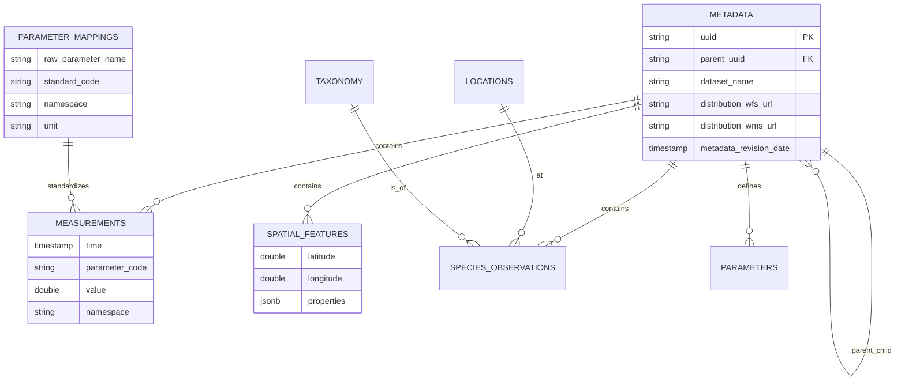

# Marine Data Platform - Database Schema Documentation

This document describes the database schema designed for the Tasmanian Climate & Marine Data Platform. The system utilizes **PostgreSQL 18+** with **TimescaleDB** (for time-series).

## High-Level Architecture

The schema is organized around a central **Metadata** registry, to which all types of data are linked:
1.  **Time-Series Data**: High-frequency sensor readings (Hypertable).
2.  **Spatial Features**: Polygons, lines, and non-time-series geometries (pure PostgreSQL).
3.  **Biological Observations**: Species occurrences and taxonomy.
4.  **Parameter Mappings**: Standardized parameter name mappings.

---

## 0. Parameter Standardization

### `parameter_mappings` ⭐ NEW

Maps raw parameter names from data files to standardized BODC/CF codes. This table **replaces** the previous `config_parameter_mapping.json` file, making parameter management dynamic and database-driven.

#### DDL

```sql
CREATE TABLE parameter_mappings (
    id SERIAL PRIMARY KEY,
    raw_parameter_name TEXT UNIQUE NOT NULL,
    standard_code TEXT NOT NULL,
    namespace TEXT NOT NULL CHECK (namespace IN ('bodc', 'cf', 'custom')),
    unit TEXT NOT NULL,
    description TEXT,
    source TEXT DEFAULT 'system',  -- 'system' or 'user'
    created_at TIMESTAMP DEFAULT NOW(),
    updated_at TIMESTAMP DEFAULT NOW()
);

CREATE INDEX idx_param_mappings_raw ON parameter_mappings(raw_parameter_name);
CREATE INDEX idx_param_mappings_code ON parameter_mappings(standard_code);
CREATE INDEX idx_param_mappings_namespace ON parameter_mappings(namespace);
```

#### Key Fields

- **`raw_parameter_name`**: The original column name from CSV/NetCDF files (e.g., `"TEMPERATURE"`, `"SEA_WATER_TEMP"`)
- **`standard_code`**: Standardized code used in `measurements` table (e.g., `"TEMP"`, `"PSAL"`)
- **`namespace`**: 
  - `bodc` = British Oceanographic Data Centre P01 codes
  - `cf` = Climate & Forecast convention standard names
  - `custom` = User-defined or unmapped parameters
- **`unit`**: Physical unit (e.g., `"Degrees Celsius"`, `"PSS-78"`)
- **`source`**: 
  - `system` = Pre-populated by `init.sql`
  - `user` = Added manually via SQL or web UI

#### Example Data

| raw_parameter_name | standard_code | namespace | unit | description |
|--------------------|---------------|-----------|------|-------------|
| TEMP | TEMP | bodc | Degrees Celsius | Sea water temperature |
| TEMPERATURE | TEMP | bodc | Degrees Celsius | Sea water temperature |
| SEA_WATER_TEMPERATURE | TEMP | cf | Degrees Celsius | CF standard name |
| CPHL | CPHL | bodc | mg/m3 | Chlorophyll-a concentration |
| CHLOROPHYLL_A | CPHL | bodc | mg/m3 | Chlorophyll-a |
| PSAL | PSAL | bodc | PSS-78 | Practical salinity |

#### Usage in ETL

The ETL script `populate_measurements_v2.py` queries this table to normalize parameter names:

```python
# ETL logic (simplified)
raw_name = csv_column_name.upper()  # "TEMPERATURE"
mapping = db.query("SELECT * FROM parameter_mappings WHERE raw_parameter_name = %s", [raw_name])
if mapping:
    standard_code = mapping['standard_code']  # "TEMP"
    namespace = mapping['namespace']          # "bodc"
    unit = mapping['unit']                    # "Degrees Celsius"
else:
    # Fallback to custom namespace
    standard_code = raw_name
    namespace = 'custom'
```

#### Adding Custom Mappings

```sql
-- Add a new parameter mapping
INSERT INTO parameter_mappings (raw_parameter_name, standard_code, namespace, unit, source)
VALUES ('MY_CUSTOM_TEMP', 'TEMP', 'custom', 'Degrees Celsius', 'user');

-- View all mappings
SELECT raw_parameter_name, standard_code, namespace, unit 
FROM parameter_mappings 
ORDER BY namespace, standard_code;

-- Find all temperature variants
SELECT * FROM parameter_mappings WHERE standard_code = 'TEMP';
```

---

## 1. Core Registry

### `metadata` ⭐ ENHANCED v4.0
The central registry for all datasets (AODN and future non-AODN sources). **Now with 34 fields** extracted from ISO 19115-3 XML metadata.

#### DDL

```sql
CREATE TABLE metadata (
    id SERIAL PRIMARY KEY,
    uuid TEXT UNIQUE NOT NULL,
    parent_uuid TEXT,  -- ⭐ NEW: Links child datasets to parent collections
    title TEXT NOT NULL,
    abstract TEXT,
    credit TEXT,  -- ⭐ ENHANCED: Multiple credits concatenated with '; '
    status TEXT,  -- onGoing, completed, etc.
    topic_category TEXT,
    
    -- ⭐ ENHANCED: Temporal metadata
    metadata_creation_date TIMESTAMP,
    metadata_revision_date TIMESTAMP,  -- ⭐ NEW: Last metadata update
    citation_date TIMESTAMP,
    
    -- Metadata standards
    language TEXT DEFAULT 'eng',
    character_set TEXT DEFAULT 'utf8',
    
    -- Spatial extent (bounding box)
    west DECIMAL(10,6),
    east DECIMAL(10,6),
    south DECIMAL(10,6),
    north DECIMAL(10,6),
    
    -- Temporal extent
    time_start DATE,
    time_end DATE,
    
    -- Vertical extent
    vertical_min DECIMAL(6,2),
    vertical_max DECIMAL(6,2),
    vertical_crs TEXT,
    
    -- Data provenance
    lineage TEXT,  -- ⭐ ENHANCED: Processing history
    supplemental_info TEXT,
    use_limitation TEXT,
    
    -- ⭐ NEW: Distribution URLs
    license_url TEXT,
    distribution_wfs_url TEXT,  -- OGC Web Feature Service
    distribution_wms_url TEXT,  -- OGC Web Map Service
    distribution_portal_url TEXT,  -- Data portal
    distribution_publication_url TEXT,  -- DOI/publication
    
    -- Dataset file paths
    dataset_name TEXT,
    dataset_path TEXT,
    
    -- Audit trail
    extracted_at TIMESTAMP DEFAULT CURRENT_TIMESTAMP,
    date_created DATE,
    
    -- PostGIS spatial extent (unlocks spatial queries)
    extent_geom GEOMETRY(POLYGON, 4326),
    bbox_envelope BOX2D GENERATED ALWAYS AS (BOX2D(extent_geom)) STORED
);

CREATE INDEX idx_metadata_uuid ON metadata(uuid);
CREATE INDEX idx_metadata_parent_uuid ON metadata(parent_uuid) WHERE parent_uuid IS NOT NULL;
CREATE INDEX idx_metadata_bbox ON metadata(west, east, south, north);
CREATE INDEX idx_metadata_time ON metadata(time_start, time_end);
CREATE INDEX idx_metadata_extent_geom ON metadata USING GIST(extent_geom);
```

#### Key Fields ⭐ ENHANCED

*   **`id`** (PK): Internal integer ID used for all foreign keys (performance).
*   **`uuid`**: Unique internal identifier. Used to link all related data (measurements, parameters, species observations). Generated by the system on insert.
*   **`parent_uuid`** ✨ **NEW**: Links child datasets to parent collection (e.g., "Chlorophyll 2020" → "Chlorophyll Database 1965-2017")
    - NULL for top-level datasets
    - Enables hierarchical dataset organization
    - Example: 26/38 datasets (68%) have parent relationships
*   **`metadata_creation_date`** ✨ **NEW**: When metadata record was originally created
*   **`metadata_revision_date`** ✨ **NEW**: Last metadata update timestamp (100% populated)
*   **`credit`** ✨ **ENHANCED**: Data contributors/funding sources
    - Multiple credits concatenated with `"; "` separator
    - Example: `"IMOS; CSIRO; University of Tasmania"`
    - 19/38 datasets (50%) have multiple credits
*   **`lineage`** ✨ **ENHANCED**: Full processing history and data provenance from XML
*   **`distribution_wfs_url`** ✨ **NEW**: OGC Web Feature Service endpoint (84% populated)
*   **`distribution_wms_url`** ✨ **NEW**: OGC Web Map Service endpoint (92% populated)
*   **`distribution_portal_url`** ✨ **NEW**: Data portal URL (45% populated)
*   **`distribution_publication_url`** ✨ **NEW**: Associated publication DOI/URL (37% populated)
*   **`license_url`** ✨ **ENHANCED**: Creative Commons or other license URL
*   **`west`, `east`, `south`, `north`**: Bounding box coordinates in decimal degrees (WGS84 / EPSG:4326). Pure PostgreSQL, no PostGIS required.
*   **`dataset_path`**: Relative path to the source folder/file on disk.
*   **`dataset_name`**: Human-readable name of the dataset (e.g., "Australian Chlorophyll-a Database").

#### XML Metadata Extraction ⭐ NEW

Metadata fields are extracted from ISO 19115-3 XML files using multiple XPath patterns:

```python
# Example extraction patterns from populate_metadata.py v4.0

# Parent UUID (links to collection)
parent_uuid = xml.find('.//mdb:parentMetadata[@uuidref]')

# Metadata dates
creation_date = xml.find('.//cit:date[.//cit:CI_DateTypeCode[@codeListValue="creation"]]/cit:date')
revision_date = xml.find('.//cit:date[.//cit:CI_DateTypeCode[@codeListValue="revision"]]/cit:date')

# Multiple credits (concatenated)
credits = xml.findall('.//mri:credit/gco:CharacterString')
credit_text = '; '.join([c.text for c in credits if c.text])

# Processing lineage
lineage = xml.find('.//mrl:statement/gco:CharacterString')

# Distribution URLs
wfs_url = xml.find('.//cit:linkage[../cit:protocol[contains(text(), "OGC:WFS")]]')
wms_url = xml.find('.//cit:linkage[../cit:protocol[contains(text(), "OGC:WMS")]]')
portal_url = xml.find('.//cit:linkage[../cit:protocol[contains(text(), "WWW:LINK-1.0-http--portal")]]')
pub_url = xml.find('.//cit:linkage[../cit:protocol[contains(text(), "WWW:LINK-1.0-http--publication")]]')
```

**Extraction Statistics (typical AODN dataset):**
- **30+ fields** extracted per XML file
- **100% success rate** for core fields (title, bbox, dates)
- **68%** datasets with parent_uuid
- **84%** datasets with WFS URLs
- **92%** datasets with WMS URLs
- **50%** datasets with multiple credits

**Extraction Patterns by XML Element:**

| Field | XML XPath Pattern | Fallback Strategy |
|-------|-------------------|-------------------|
| `parent_uuid` | `mdb:parentMetadata[@uuidref]` | NULL if not found |
| `metadata_revision_date` | `cit:date[cit:CI_DateTypeCode="revision"]` | Use creation_date |
| `credit` | All `mri:credit/gco:CharacterString` | Concatenate with "; " |
| `lineage` | `mrl:statement/gco:CharacterString` | Try 3 different patterns |
| `distribution_wfs_url` | `cit:linkage[protocol="OGC:WFS"]` | NULL if not found |
| `license_url` | `mrd:graphicOverview/cit:onlineResource` | NULL if not found |

#### Relationships

| Field | Links To | Purpose |
|-------|----------|---------|
| `id` | FK in `parameters`, `measurements`, `species_observations` | Primary relationships |
| `uuid` | FK in `measurements.uuid`, `parameters.uuid` | Backward reference field |
| `parent_uuid` | `metadata.uuid` | Hierarchical dataset relationships |

#### Usage Examples

```sql
-- Find all child datasets of a collection
SELECT id, title, dataset_name
FROM metadata
WHERE parent_uuid = 'abc123-parent-uuid';

-- Get dataset with all distribution endpoints
SELECT 
  title, 
  distribution_wfs_url, 
  distribution_wms_url, 
  distribution_portal_url
FROM metadata
WHERE distribution_wfs_url IS NOT NULL;

-- Find datasets updated in last year
SELECT title, metadata_revision_date
FROM metadata
WHERE metadata_revision_date > NOW() - INTERVAL '1 year'
ORDER BY metadata_revision_date DESC;

-- Get all credits for a dataset
SELECT title, credit
FROM metadata
WHERE credit LIKE '%;%';  -- Multiple credits

-- Find datasets by contributor
SELECT title, credit
FROM metadata
WHERE credit ILIKE '%CSIRO%';

-- Get hierarchical dataset tree
WITH RECURSIVE dataset_tree AS (
  -- Root datasets
  SELECT id, uuid, parent_uuid, title, 0 as level
  FROM metadata
  WHERE parent_uuid IS NULL
  
  UNION ALL
  
  -- Child datasets
  SELECT m.id, m.uuid, m.parent_uuid, m.title, dt.level + 1
  FROM metadata m
  INNER JOIN dataset_tree dt ON m.parent_uuid = dt.uuid
)
SELECT 
  REPEAT('  ', level) || title as hierarchy,
  uuid,
  parent_uuid
FROM dataset_tree
ORDER BY level, title;
```

### `parameters` (One-to-Many with Metadata)
Describes specific variables available in a dataset (e.g., "Sea Surface Temperature").

#### DDL

```sql
CREATE TABLE parameters (
    id SERIAL PRIMARY KEY,
    metadata_id INTEGER REFERENCES metadata(id) ON DELETE CASCADE,
    uuid TEXT NOT NULL REFERENCES metadata(uuid) ON DELETE CASCADE,
    parameter_code TEXT NOT NULL,
    parameter_label TEXT,
    standard_name TEXT,
    aodn_parameter_uri TEXT,
    unit_name TEXT,
    unit_uri TEXT,
    content_type TEXT DEFAULT 'physicalMeasurement',
    is_depth BOOLEAN DEFAULT FALSE,
    temporal_start TIMESTAMP,
    temporal_end TIMESTAMP,
    vertical_min NUMERIC(6,2),
    vertical_max NUMERIC(6,2),
    created_at TIMESTAMP DEFAULT NOW(),
    imos_parameter_uri TEXT REFERENCES imos_vocab_parameters(uri),
    imos_unit_uri TEXT REFERENCES imos_vocab_units(uri),
    UNIQUE(uuid, parameter_code)
);
```

#### Key Fields

*   **`parameter_code`**: Critical linking field. Matches `parameter_code` in the `measurements` table.
*   **`aodn_parameter_uri`**: Link to the controlled vocabulary definition.

---

## 2. Time-Series Data (TimescaleDB)

### `measurements`
A **Hypertable** partitioned by `time`. Stores physical and chemical sensor data.

#### DDL

```sql
CREATE TABLE measurements (
    time TIMESTAMPTZ NOT NULL,
    data_id BIGSERIAL PRIMARY KEY,
    uuid TEXT REFERENCES metadata(uuid) ON DELETE CASCADE,
    parameter_code TEXT NOT NULL,
    namespace TEXT NOT NULL DEFAULT 'custom',
    value DOUBLE PRECISION NOT NULL,
    uom TEXT NOT NULL,
    uncertainty DOUBLE PRECISION,
    depth_m NUMERIC,
    location_id BIGINT REFERENCES locations(id),
    metadata_id INTEGER REFERENCES metadata(id),
    quality_flag SMALLINT DEFAULT 1
);

-- Convert to hypertable
SELECT create_hypertable('measurements', by_range('time'));

-- Add compression
SELECT add_compression_policy('measurements', INTERVAL '7 days');
```

#### Key Fields

*   **`time`**: Timestamp of observation.
*   **`parameter_code`**: The variable being measured (e.g., `TEMP`, `PSAL`, `CPHL`). Links to `parameter_mappings.standard_code`.
*   **`value`**: Numeric value of the measurement.
*   **`uom`**: Unit of measure (e.g., "Degrees Celsius").
*   **`namespace`**: **[Key Field]**
    *   `bodc`: Standardized code (British Oceanographic Data Centre). Use for robust queries.
    *   `custom`: Raw variable name from a file if no standard mapping existed.
    *   `cf`: Climate and Forecast standard name.
*   **`quality_flag`**: Integer (1=Good, 4=Bad/Fail). Always filter by `quality_flag = 1` for analysis.
*   **`metadata_id`**: FK to `metadata`.

> **Note**: This table is optimized for aggregations (daily/hourly means) via TimescaleDB Continuous Aggregates (`measurements_1h`, `measurements_1d`).

---

## 3. Spatial Data (Pure PostgreSQL - No PostGIS)

### `locations`
Distinct survey sites extracted from data files. Uses pure PostgreSQL lat/lon, no PostGIS.

#### DDL

```sql
CREATE TABLE locations (
    id SERIAL PRIMARY KEY,
    location_name text,
    location_type text DEFAULT 'observation_site',
    longitude double precision,
    latitude double precision,
    description text,
    created_at timestamp without time zone DEFAULT now(),
    CONSTRAINT unique_lat_lon UNIQUE (latitude, longitude)
);

CREATE INDEX idx_locations_lat_lon ON locations (latitude, longitude);
CREATE INDEX idx_locations_lat_lon_partial
  ON locations (latitude, longitude)
  WHERE latitude IS NOT NULL AND longitude IS NOT NULL;
```

### `spatial_features`
Stores non-time-series spatial data using pure PostgreSQL (no PostGIS geometries).

#### DDL

```sql
CREATE TABLE spatial_features (
    id SERIAL PRIMARY KEY,
    metadata_id INTEGER REFERENCES metadata(id),
    uuid TEXT,
    latitude DOUBLE PRECISION,
    longitude DOUBLE PRECISION,
    properties JSONB
);

CREATE INDEX spatial_features_lat_lon_idx ON spatial_features (latitude, longitude);
```

#### Key Fields

*   **`latitude`, `longitude`**: Point coordinates in decimal degrees (WGS84).
*   **`properties`**: **[Key Field] JSONB** column containing all feature attributes (e.g., `{"density": "High", "area_ha": 50}`). This allows schema-less storage of diverse shapefile attributes.
*   **`metadata_id`**: FK to `metadata`.

---

## 4. Biological Data

Designed for species abundance and occurrence data.

### `taxonomy`
A normalized registry of species.

#### DDL

```sql
CREATE TABLE taxonomy (
    id SERIAL PRIMARY KEY,
    species_name TEXT UNIQUE NOT NULL,
    common_name TEXT,
    family TEXT,
    phylum TEXT,
    class TEXT,
    "order" TEXT,
    genus TEXT,
    authority TEXT
);
```

#### Key Fields

*   **`species_name`**: Scientific name (Unique).
*   **`common_name`**: Vernacular name.
*   **`family`, `phylum`, `class`**: Taxonomic hierarchy.

### `species_observations`
The core fact table for biology.

#### DDL

```sql
CREATE TABLE species_observations (
    id SERIAL PRIMARY KEY,
    metadata_id INTEGER REFERENCES metadata(id),
    location_id INTEGER REFERENCES locations(id),
    taxonomy_id INTEGER REFERENCES taxonomy(id),
    observation_date TIMESTAMP,
    count_value NUMERIC,
    count_category TEXT,
    depth_m NUMERIC,
    sex TEXT,
    size_class TEXT,
    method TEXT,
    notes TEXT,
    latitude DOUBLE PRECISION,
    longitude DOUBLE PRECISION
);

CREATE INDEX idx_species_obs_lat_lon ON species_observations (latitude, longitude);
```

#### Key Fields

*   **`taxonomy_id`**: FK to `taxonomy`.
*   **`location_id`**: FK to `locations`.
*   **`count_value`**: Numeric abundance (if available).
*   **`count_category`**: Text description if count is a range (e.g., "DOC" - Dominant).
*   **`latitude`, `longitude`**: **[Key Field]** Denormalized coordinates. While redundant with `locations`, storing them here allows for faster heatmap generation and spatial filtering without joins.

---

## Key Relationships Diagram



---

## Continuous Aggregates (TimescaleDB)

Pre-computed rollups for Grafana dashboard performance.

### `measurements_1h`

Hourly aggregates of measurements.

```sql
CREATE MATERIALIZED VIEW measurements_1h
WITH (timescaledb.continuous) AS
SELECT time_bucket('1 hour', time) AS bucket,
       parameter_code, namespace, location_id, metadata_id,
       AVG(value) AS avg_value, 
       STDDEV(value) AS stddev_value,
       COUNT(*) AS count,
       MIN(quality_flag) AS min_quality
FROM measurements 
GROUP BY bucket, parameter_code, namespace, location_id, metadata_id;
```

### `measurements_1d`

Daily aggregates of measurements.

```sql
CREATE MATERIALIZED VIEW measurements_1d
WITH (timescaledb.continuous) AS
SELECT time_bucket('1 day', time) AS bucket,
       parameter_code, namespace, location_id,
       AVG(value) AS avg_value, 
       STDDEV(value) AS stddev_value,
       COUNT(*) AS count
FROM measurements 
GROUP BY bucket, parameter_code, namespace, location_id;
```

---

## Views

### `measurements_with_metadata`

Grafana-friendly view joining measurements with dataset metadata.

```sql
CREATE VIEW measurements_with_metadata AS
SELECT 
    m.time, m.data_id, m.parameter_code, m.namespace, m.value, m.uom,
    m.uncertainty, m.depth_m, m.location_id, m.quality_flag,
    md.title AS dataset_title,
    md.dataset_name,
    md.metadata_revision_date,
    md.credit,
    p.parameter_label,
    p.unit_name,
    md.west, md.east, md.south, md.north
FROM measurements m
LEFT JOIN metadata md ON m.metadata_id = md.id
LEFT JOIN parameters p ON md.id = p.metadata_id AND m.parameter_code = p.parameter_code;
```

### `datasets_by_parameter`

Spatial view showing which datasets contain specific parameters.

```sql
CREATE VIEW datasets_by_parameter AS
SELECT 
    p.parameter_code,
    p.parameter_label,
    p.aodn_parameter_uri,
    COUNT(DISTINCT md.id) AS dataset_count,
    MIN(md.west) AS bbox_west,
    MIN(md.south) AS bbox_south,
    MAX(md.east) AS bbox_east,
    MAX(md.north) AS bbox_north,
    ARRAY_AGG(DISTINCT md.dataset_name) AS datasets
FROM parameters p
JOIN metadata md ON p.metadata_id = md.id
GROUP BY p.parameter_code, p.parameter_label, p.aodn_parameter_uri;
```

---

## Performance Features

### Indexes

- **B-tree indexes** on all foreign keys and commonly filtered columns
- **Sparse B-tree index** on `metadata.parent_uuid` (only non-null values)
- **BRIN indexes** on `measurements.time` for efficient time-range scans
- **GIN indexes** on text columns for text search
- **Composite indexes** for multi-column queries (e.g., bbox + time)

### Compression

- **TimescaleDB compression** on `measurements` table after 7 days
- Expected **90% space savings** on compressed data

### Partitioning

- `measurements` is a **hypertable** automatically partitioned by time
- Query performance optimized for time-range filters (Grafana dashboards)

---

## Common Queries

### Find all datasets with chlorophyll data

```sql
SELECT DISTINCT md.title, md.dataset_name, md.metadata_revision_date
FROM measurements m
JOIN metadata md ON m.metadata_id = md.id
WHERE m.parameter_code = 'CPHL' AND m.namespace = 'bodc';
```

### Get temperature time-series for specific location

```sql
SELECT time, value, uom, quality_flag
FROM measurements
WHERE parameter_code = 'TEMP' 
  AND namespace = 'bodc'
  AND location_id = 42
  AND time BETWEEN '2023-01-01' AND '2023-12-31'
  AND quality_flag = 1
ORDER BY time;
```

### Find datasets with WFS endpoints

```sql
SELECT title, dataset_name, distribution_wfs_url
FROM metadata
WHERE distribution_wfs_url IS NOT NULL
ORDER BY title;
```

### Get parameter mapping variants

```sql
-- Find all ways to represent temperature
SELECT raw_parameter_name, standard_code, namespace, unit
FROM parameter_mappings
WHERE standard_code = 'TEMP'
ORDER BY namespace, raw_parameter_name;
```

### Find child datasets of a collection

```sql
SELECT id, title, dataset_name, metadata_revision_date
FROM metadata
WHERE parent_uuid = '744ac2a9-689c-40d3-b262-0df6863f0327'
ORDER BY metadata_revision_date DESC;
```

### Get datasets by contributor

```sql
SELECT title, credit, metadata_revision_date
FROM metadata
WHERE credit ILIKE '%CSIRO%'
ORDER BY metadata_revision_date DESC;
```

### Get hierarchical dataset relationships

```sql
WITH RECURSIVE dataset_tree AS (
  -- Root datasets (no parent)
  SELECT id, uuid, parent_uuid, title, 0 as level
  FROM metadata
  WHERE parent_uuid IS NULL
  
  UNION ALL
  
  -- Child datasets
  SELECT m.id, m.uuid, m.parent_uuid, m.title, dt.level + 1
  FROM metadata m
  INNER JOIN dataset_tree dt ON m.parent_uuid = dt.uuid
)
SELECT 
  REPEAT('  ', level) || title as hierarchy,
  uuid,
  parent_uuid,
  level
FROM dataset_tree
ORDER BY level, title;
```

---

## Schema Migration Notes

### Version History

- **v1.0** (2025-12-18): Initial schema with measurements, metadata, spatial features
- **v1.1** (2025-12-20): Added `parameter_mappings` table to replace JSON config
- **v3.0** (2025-12-30): Removed PostGIS dependency, pure PostgreSQL spatial columns
- **v3.1** (2025-12-30): Added `aodn_uuid` field for AODN provenance tracking
- **v4.0** (2026-01-04): ✨ **MAJOR UPDATE** - Enhanced metadata table with 30+ fields:
  - Added `parent_uuid` for hierarchical datasets (68% populated)
  - Added `metadata_revision_date` for change tracking (100% populated)
  - Added distribution URLs: WFS (84%), WMS (92%), Portal (45%), Publication (37%)
  - Enhanced `credit` field with multi-contributor support (50% have multiple credits)
  - Enhanced `lineage` with full processing history from XML
  - Added `license_url` for data licensing
  - Full ISO 19115-3 XML metadata extraction (30+ fields per dataset)

### Migration from v3.1 to v4.0

The schema is already up-to-date if using `init.sql` from v4.0. For existing databases:

```sql
-- Verify current schema version
SELECT column_name, data_type 
FROM information_schema.columns 
WHERE table_name = 'metadata' 
ORDER BY ordinal_position;

-- Check if new fields exist
SELECT EXISTS (
  SELECT 1 FROM information_schema.columns 
  WHERE table_name = 'metadata' AND column_name = 'parent_uuid'
) AS has_parent_uuid;

-- Check field population rates
SELECT 
  COUNT(*) as total_records,
  COUNT(parent_uuid) as has_parent_uuid,
  COUNT(metadata_revision_date) as has_revision_date,
  COUNT(distribution_wfs_url) as has_wfs,
  COUNT(distribution_portal_url) as has_portal,
  ROUND(100.0 * COUNT(parent_uuid) / COUNT(*), 1) as pct_parent,
  ROUND(100.0 * COUNT(metadata_revision_date) / COUNT(*), 1) as pct_revision,
  ROUND(100.0 * COUNT(distribution_wfs_url) / COUNT(*), 1) as pct_wfs
FROM metadata;
```

If fields are missing, they will be added by re-running `populate_metadata.py` which creates fields on-the-fly.

### Re-populating Enhanced Metadata

To update existing records with enhanced metadata:

```bash
# Backup existing database
pg_dump -h localhost -p 5433 -U marine_user -d marine_db > backup_v3.sql

# Run enhanced metadata extraction
python scripts/populate_metadata.py

# Verify results
psql -h localhost -p 5433 -U marine_user -d marine_db -c "
SELECT title, parent_uuid, metadata_revision_date, 
       distribution_wfs_url IS NOT NULL as has_wfs
FROM metadata LIMIT 5;"
```

### Future Enhancements

- [ ] Automated metadata refresh pipeline (daily sync from AODN)
- [ ] Web UI for parameter mapping management
- [ ] IMOS vocabulary table population from AODN API
- [ ] Real-time data ingestion pipeline (streaming)
- [ ] Data quality scoring metrics table
- [ ] Versioned metadata (track changes over time)
- [ ] Full-text search on metadata using PostgreSQL `tsvector`

---

## References

- **TimescaleDB Documentation**: https://docs.timescale.com/
- **PostgreSQL Documentation**: https://www.postgresql.org/docs/
- **BODC Parameter Vocabulary**: https://www.bodc.ac.uk/data/codes_and_formats/vocabulary_search/
- **CF Conventions**: https://cfconventions.org/
- **AODN/IMOS**: https://aodn.org.au/
- **ISO 19115-3 Standard**: https://www.iso.org/standard/32579.html

---

*Last Updated: January 4, 2026*  
*Schema Version: 4.0*  
*Contributors: Huon Channel Marine Analytics Project*