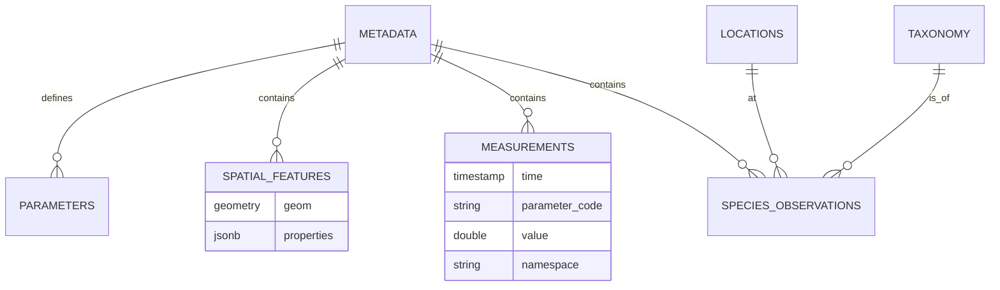

# Marine Data Platform - Database Schema Documentation

This document describes the database schema designed for the Tasmanian Climate & Marine Data Platform. The system utilizes **PostgreSQL 14+** with **TimescaleDB** (for time-series) and **PostGIS** (for spatial features).

## High-Level Architecture

The schema is organized around a central **Metadata** registry, to which all three types of data are linked:
1.  **Time-Series Data**: High-frequency sensor readings (Hypertable).
2.  **Spatial Features**: Polygons, lines, and non-time-series geometries.
3.  **Biological Observations**: Species occurrences and taxonomy.

---

## 1. Core Registry

### `metadata`
The central table for all datasets. Every file or distinct dataset ingested has an entry here.

*   **`id`** (PK): Internal integer ID used for all foreign keys (performance).
*   **`uuid`**: The AODN/IMOS UUID from the original ISO 19115 XML.
*   **`extent_geom`**: A PostGIS POLYGON representing the bounding box of the entire dataset. Used for "Find datasets in this area" queries.
*   **`dataset_path`**: Relative path to the source folder/file on disk.

### `parameters` (One-to-Many with Metadata)
Describes specific variables available in a dataset (e.g., "Sea Surface Temperature").

*   **`parameter_code`**: Critical linking field. Matches `parameter_code` in the `measurements` table.
*   **`aodn_parameter_uri`**: Link to the controlled vocabulary definition.

---

## 2. Time-Series Data (TimescaleDB)

### `measurements`
A **Hypertable** partitioned by `time`. Stores physical and chemical sensor data.

*   **`time`**: Timestamp of observation.
*   **`parameter_code`**: The variable being measured (e.g., `TEMP`, `PSAL`, `CPHL`).
*   **`value`**: Numeric value of the measurement.
*   **`uom`**: Unit of measure (e.g., "Degrees Celsius").
*   **`namespace`**: **[Key Field]**
    *   `bodc`: Standardized code (British Oceanographic Data Centre). Use for robust queries.
    *   `custom`: Raw variable name from a file if no standard mapping existed.
    *   `cf`: Climate and Forecast standard name.
*   **`quality_flag`**: Integer (1=Good, 4=Bad/Fail). Always filter by `quality_flag = 1` for analysis.
*   **`metadata_id`**: FK to `metadata`.

> **Note**: This table is optimized for aggregations (daily/hourly means) via TimescaleDB Continuous Aggregates (`measurements_1h`, `measurements_1d`).

---

## 3. Spatial Data (PostGIS)

### `spatial_features`
Stores non-time-series geometries, such as Seagrass extent polygons or survey tracks.

*   **`geom`**: PostGIS Geometry (Polygon, MultiPolygon, or LineString). SRID 4326.
*   **`properties`**: **[Key Field] JSONB** column containing all feature attributes (e.g., `{"density": "High", "area_ha": 50}`). This allows schema-less storage of diverse shapefile attributes.
*   **`metadata_id`**: FK to `metadata`.

---

## 4. Biological Data

Designed for species abundance and occurrence data.

### `taxonomy`
A normalized registry of species.

*   **`species_name`**: Scientific name (Unique).
*   **`common_name`**: Vernacular name.
*   **`family`, `phylum`, `class`**: Taxonomic hierarchy.

### `locations`
Distinct survey sites extracted from data files.

*   **`location_name`**: Site code or name.
*   **`location_geom`**: Point geometry of the site.
*   **`latitude`, `longitude`**: Cached coordinates.

### `species_observations`
The core fact table for biology.

*   **`taxonomy_id`**: FK to `taxonomy`.
*   **`location_id`**: FK to `locations`.
*   **`count_value`**: Numeric abundance (if available).
*   **`count_category`**: Text description if count is a range (e.g., "DOC" - Dominant).
*   **`geom`**: **[Key Field]** Denormalized Point geometry. While redundant with `locations`, storing it here allows for faster heatmap generation and spatial filtering without joins.

---

## Key Relationships Diagram

