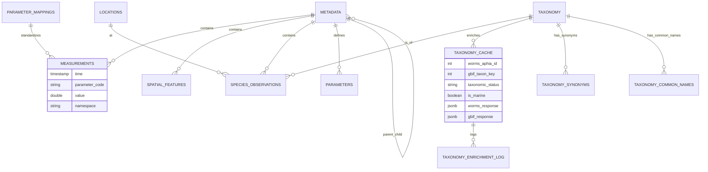

# Marine Data Platform - Database Schema Documentation

This document describes the database schema designed for the Tasmanian Climate & Marine Data Platform. The system utilizes **PostgreSQL 18+** with **TimescaleDB** (for time-series).

## High-Level Architecture

The schema is organized around a central **Metadata** registry, to which all types of data are linked:
1.  **Time-Series Data**: High-frequency sensor readings (Hypertable).
2.  **Spatial Features**: Polygons, lines, and non-time-series geometries (pure PostgreSQL).
3.  **Biological Observations**: Species occurrences and taxonomy.
4.  **Parameter Mappings**: Standardized parameter name mappings.
5.  **Taxonomy Enrichment**: WoRMS & GBIF API integration for species data.

---

## 0. Parameter Standardization

### `parameter_mappings` ⭐ NEW

Maps raw parameter names from data files to standardized BODC/CF codes. This table **replaces** the previous `config_parameter_mapping.json` file, making parameter management dynamic and database-driven.

#### DDL

```sql
CREATE TABLE parameter_mappings (
    id SERIAL PRIMARY KEY,
    raw_parameter_name TEXT UNIQUE NOT NULL,
    standard_code TEXT NOT NULL,
    namespace TEXT NOT NULL CHECK (namespace IN ('bodc', 'cf', 'custom')),
    unit TEXT NOT NULL,
    description TEXT,
    source TEXT DEFAULT 'system',  -- 'system' or 'user'
    created_at TIMESTAMP DEFAULT NOW(),
    updated_at TIMESTAMP DEFAULT NOW()
);

CREATE INDEX idx_param_mappings_raw ON parameter_mappings(raw_parameter_name);
CREATE INDEX idx_param_mappings_code ON parameter_mappings(standard_code);
CREATE INDEX idx_param_mappings_namespace ON parameter_mappings(namespace);
```

#### Key Fields

- **`raw_parameter_name`**: The original column name from CSV/NetCDF files (e.g., `"TEMPERATURE"`, `"SEA_WATER_TEMP"`)
- **`standard_code`**: Standardized code used in `measurements` table (e.g., `"TEMP"`, `"PSAL"`)
- **`namespace`**: 
  - `bodc` = British Oceanographic Data Centre P01 codes
  - `cf` = Climate & Forecast convention standard names
  - `custom` = User-defined or unmapped parameters
- **`unit`**: Physical unit (e.g., `"Degrees Celsius"`, `"PSS-78"`)
- **`source`**: 
  - `system` = Pre-populated by `init.sql`
  - `user` = Added manually via SQL or web UI

#### Example Data

| raw_parameter_name | standard_code | namespace | unit | description |
|--------------------|---------------|-----------|------|-------------|
| TEMP | TEMP | bodc | Degrees Celsius | Sea water temperature |
| TEMPERATURE | TEMP | bodc | Degrees Celsius | Sea water temperature |
| SEA_WATER_TEMPERATURE | TEMP | cf | Degrees Celsius | CF standard name |
| CPHL | CPHL | bodc | mg/m3 | Chlorophyll-a concentration |
| CHLOROPHYLL_A | CPHL | bodc | mg/m3 | Chlorophyll-a |
| PSAL | PSAL | bodc | PSS-78 | Practical salinity |

#### Usage in ETL

The ETL script `populate_measurements_v2.py` queries this table to normalize parameter names:

```python
# ETL logic (simplified)
raw_name = csv_column_name.upper()  # "TEMPERATURE"
mapping = db.query("SELECT * FROM parameter_mappings WHERE raw_parameter_name = %s", [raw_name])
if mapping:
    standard_code = mapping['standard_code']  # "TEMP"
    namespace = mapping['namespace']          # "bodc"
    unit = mapping['unit']                    # "Degrees Celsius"
else:
    # Fallback to custom namespace
    standard_code = raw_name
    namespace = 'custom'
```

#### Adding Custom Mappings

```sql
-- Add a new parameter mapping
INSERT INTO parameter_mappings (raw_parameter_name, standard_code, namespace, unit, source)
VALUES ('MY_CUSTOM_TEMP', 'TEMP', 'custom', 'Degrees Celsius', 'user');

-- View all mappings
SELECT raw_parameter_name, standard_code, namespace, unit 
FROM parameter_mappings 
ORDER BY namespace, standard_code;

-- Find all temperature variants
SELECT * FROM parameter_mappings WHERE standard_code = 'TEMP';
```

---

## 1. Core Registry

### `metadata` ⭐ ENHANCED v4.0
The central registry for all datasets (AODN and future non-AODN sources). **Now with 34 fields** extracted from ISO 19115-3 XML metadata.

#### DDL

```sql
CREATE TABLE metadata (
    id SERIAL PRIMARY KEY,
    uuid TEXT UNIQUE NOT NULL,
    parent_uuid TEXT,  -- ⭐ NEW: Links child datasets to parent collections
    title TEXT NOT NULL,
    abstract TEXT,
    credit TEXT,  -- ⭐ ENHANCED: Multiple credits concatenated with '; '
    status TEXT,  -- onGoing, completed, etc.
    topic_category TEXT,
    
    -- ⭐ ENHANCED: Temporal metadata
    metadata_creation_date TIMESTAMP,
    metadata_revision_date TIMESTAMP,  -- ⭐ NEW: Last metadata update
    citation_date TIMESTAMP,
    
    -- Metadata standards
    language TEXT DEFAULT 'eng',
    character_set TEXT DEFAULT 'utf8',
    
    -- Spatial extent (bounding box)
    west DECIMAL(10,6),
    east DECIMAL(10,6),
    south DECIMAL(10,6),
    north DECIMAL(10,6),
    
    -- Temporal extent
    time_start DATE,
    time_end DATE,
    
    -- Vertical extent
    vertical_min DECIMAL(6,2),
    vertical_max DECIMAL(6,2),
    vertical_crs TEXT,
    
    -- Data provenance
    lineage TEXT,  -- ⭐ ENHANCED: Processing history
    supplemental_info TEXT,
    use_limitation TEXT,
    
    -- ⭐ NEW: Distribution URLs
    license_url TEXT,
    distribution_wfs_url TEXT,  -- OGC Web Feature Service
    distribution_wms_url TEXT,  -- OGC Web Map Service
    distribution_portal_url TEXT,  -- Data portal
    distribution_publication_url TEXT,  -- DOI/publication
    
    -- Dataset file paths
    dataset_name TEXT,
    dataset_path TEXT,
    
    -- Audit trail
    extracted_at TIMESTAMP DEFAULT CURRENT_TIMESTAMP,
    date_created DATE,
    
    -- PostGIS spatial extent (unlocks spatial queries)
    extent_geom GEOMETRY(POLYGON, 4326),
    bbox_envelope BOX2D GENERATED ALWAYS AS (BOX2D(extent_geom)) STORED
);

CREATE INDEX idx_metadata_uuid ON metadata(uuid);
CREATE INDEX idx_metadata_parent_uuid ON metadata(parent_uuid) WHERE parent_uuid IS NOT NULL;
CREATE INDEX idx_metadata_bbox ON metadata(west, east, south, north);
CREATE INDEX idx_metadata_time ON metadata(time_start, time_end);
CREATE INDEX idx_metadata_extent_geom ON metadata USING GIST(extent_geom);
```

#### Key Fields ⭐ ENHANCED

*   **`id`** (PK): Internal integer ID used for all foreign keys (performance).
*   **`uuid`**: Unique internal identifier. Used to link all related data (measurements, parameters, species observations). Generated by the system on insert.
*   **`parent_uuid`** ✨ **NEW**: Links child datasets to parent collection (e.g., "Chlorophyll 2020" → "Chlorophyll Database 1965-2017")
    - NULL for top-level datasets
    - Enables hierarchical dataset organization
    - Example: 26/38 datasets (68%) have parent relationships
*   **`metadata_creation_date`** ✨ **NEW**: When metadata record was originally created
*   **`metadata_revision_date`** ✨ **NEW**: Last metadata update timestamp (100% populated)
*   **`credit`** ✨ **ENHANCED**: Data contributors/funding sources
    - Multiple credits concatenated with `"; "` separator
    - Example: `"IMOS; CSIRO; University of Tasmania"`
    - 19/38 datasets (50%) have multiple credits
*   **`lineage`** ✨ **ENHANCED**: Full processing history and data provenance from XML
*   **`distribution_wfs_url`** ✨ **NEW**: OGC Web Feature Service endpoint (84% populated)
*   **`distribution_wms_url`** ✨ **NEW**: OGC Web Map Service endpoint (92% populated)
*   **`distribution_portal_url`** ✨ **NEW**: Data portal URL (45% populated)
*   **`distribution_publication_url`** ✨ **NEW**: Associated publication DOI/URL (37% populated)
*   **`license_url`** ✨ **ENHANCED**: Creative Commons or other license URL
*   **`west`, `east`, `south`, `north`**: Bounding box coordinates in decimal degrees (WGS84 / EPSG:4326). Pure PostgreSQL, no PostGIS required.
*   **`dataset_path`**: Relative path to the source folder/file on disk.
*   **`dataset_name`**: Human-readable name of the dataset (e.g., "Australian Chlorophyll-a Database").

---

## 2. Time-Series Data (TimescaleDB)

### `measurements`
A **Hypertable** partitioned by `time`. Stores physical and chemical sensor data.

#### DDL

```sql
CREATE TABLE measurements (
    time TIMESTAMPTZ NOT NULL,
    data_id BIGSERIAL PRIMARY KEY,
    uuid TEXT REFERENCES metadata(uuid) ON DELETE CASCADE,
    parameter_code TEXT NOT NULL,
    namespace TEXT NOT NULL DEFAULT 'custom',
    value DOUBLE PRECISION NOT NULL,
    uom TEXT NOT NULL,
    uncertainty DOUBLE PRECISION,
    depth_m NUMERIC,
    location_id BIGINT REFERENCES locations(id),
    metadata_id INTEGER REFERENCES metadata(id),
    quality_flag SMALLINT DEFAULT 1
);

-- Convert to hypertable
SELECT create_hypertable('measurements', by_range('time'));

-- Add compression
SELECT add_compression_policy('measurements', INTERVAL '7 days');
```

#### Key Fields

*   **`time`**: Timestamp of observation.
*   **`parameter_code`**: The variable being measured (e.g., `TEMP`, `PSAL`, `CPHL`). Links to `parameter_mappings.standard_code`.
*   **`value`**: Numeric value of the measurement.
*   **`uom`**: Unit of measure (e.g., "Degrees Celsius").
*   **`namespace`**: **[Key Field]**
    *   `bodc`: Standardized code (British Oceanographic Data Centre). Use for robust queries.
    *   `custom`: Raw variable name from a file if no standard mapping existed.
    *   `cf`: Climate and Forecast standard name.
*   **`quality_flag`**: Integer (1=Good, 4=Bad/Fail). Always filter by `quality_flag = 1` for analysis.
*   **`metadata_id`**: FK to `metadata`.

> **Note**: This table is optimized for aggregations (daily/hourly means) via TimescaleDB Continuous Aggregates (`measurements_1h`, `measurements_1d`).

---

## 3. Spatial Data (Pure PostgreSQL - No PostGIS)

### `locations`
Distinct survey sites extracted from data files. Uses pure PostgreSQL lat/lon, no PostGIS.

#### DDL

```sql
CREATE TABLE locations (
    id SERIAL PRIMARY KEY,
    location_name text,
    location_type text DEFAULT 'observation_site',
    longitude double precision,
    latitude double precision,
    description text,
    created_at timestamp without time zone DEFAULT now(),
    CONSTRAINT unique_lat_lon UNIQUE (latitude, longitude)
);

CREATE INDEX idx_locations_lat_lon ON locations (latitude, longitude);
CREATE INDEX idx_locations_lat_lon_partial
  ON locations (latitude, longitude)
  WHERE latitude IS NOT NULL AND longitude IS NOT NULL;
```

### `spatial_features`
Stores non-time-series spatial data using pure PostgreSQL (no PostGIS geometries).

#### DDL

```sql
CREATE TABLE spatial_features (
    id SERIAL PRIMARY KEY,
    metadata_id INTEGER REFERENCES metadata(id),
    uuid TEXT,
    latitude DOUBLE PRECISION,
    longitude DOUBLE PRECISION,
    properties JSONB
);

CREATE INDEX spatial_features_lat_lon_idx ON spatial_features (latitude, longitude);
```

---

## 4. Biological Data

Designed for species abundance and occurrence data.

### `taxonomy`
A normalized registry of species.

#### DDL

```sql
CREATE TABLE taxonomy (
    id SERIAL PRIMARY KEY,
    species_name TEXT UNIQUE NOT NULL,
    common_name TEXT,
    family TEXT,
    phylum TEXT,
    class TEXT,
    "order" TEXT,
    genus TEXT,
    authority TEXT
);
```

### `species_observations`
The core fact table for biology.

#### DDL

```sql
CREATE TABLE species_observations (
    id SERIAL PRIMARY KEY,
    metadata_id INTEGER REFERENCES metadata(id),
    location_id INTEGER REFERENCES locations(id),
    taxonomy_id INTEGER REFERENCES taxonomy(id),
    observation_date TIMESTAMP,
    count_value NUMERIC,
    count_category TEXT,
    depth_m NUMERIC,
    sex TEXT,
    size_class TEXT,
    method TEXT,
    notes TEXT,
    latitude DOUBLE PRECISION,
    longitude DOUBLE PRECISION
);

CREATE INDEX idx_species_obs_lat_lon ON species_observations (latitude, longitude);
```

---

## 5. Taxonomy Enrichment (WoRMS & GBIF) ⭐ NEW v3.3

Automatic enrichment of species data from authoritative taxonomic databases:
- **WoRMS** (World Register of Marine Species): Marine species authority
- **GBIF** (Global Biodiversity Information Facility): Terrestrial/freshwater fallback

### `taxonomy_cache` ⭐ PRIMARY ENRICHMENT TABLE

Caches enriched taxonomic data from external APIs (iNaturalist, WoRMS, GBIF). Avoids repeated API calls and stores additional metadata not available in source observation files.

#### DDL

```sql
CREATE TABLE taxonomy_cache (
    id SERIAL PRIMARY KEY,
    taxonomy_id INTEGER REFERENCES taxonomy(id) ON DELETE CASCADE,
    species_name TEXT UNIQUE NOT NULL,
    
    -- iNaturalist identifiers (from previous enrichment)
    inaturalist_taxon_id INTEGER,
    inaturalist_url TEXT,
    
    -- Taxonomic hierarchy (enriched from APIs)
    common_name TEXT,
    genus TEXT,
    family TEXT,
    "order" TEXT,
    class TEXT,
    phylum TEXT,
    kingdom TEXT,
    authority TEXT,
    
    -- Taxonomic metadata
    rank TEXT,  -- species, genus, family, order, class, phylum, kingdom
    rank_level INTEGER,  -- Numeric rank (10=species, 20=genus, etc.)
    iconic_taxon_name TEXT,  -- Plantae, Animalia, Chromista, Protozoa, Fungi
    
    -- Conservation & distribution
    conservation_status TEXT,  -- IUCN status if available
    conservation_status_source TEXT,
    introduced BOOLEAN DEFAULT FALSE,
    endemic BOOLEAN DEFAULT FALSE,
    threatened BOOLEAN DEFAULT FALSE,
    
    -- External links
    wikipedia_url TEXT,
    wikipedia_summary TEXT,
    photo_url TEXT,
    photo_attribution TEXT,
    
    -- ⭐ WoRMS data (World Register of Marine Species)
    worms_aphia_id INTEGER,
    worms_lsid TEXT,  -- Life Science Identifier
    worms_url TEXT,  -- Direct URL to WoRMS species page
    worms_valid_name TEXT,  -- Accepted valid name if this is a synonym
    scientific_name_authorship TEXT,  -- Taxonomic authority from WoRMS/GBIF
    taxonomic_status TEXT,  -- accepted, synonym, invalid, etc.
    accepted_name TEXT,  -- Valid/accepted name if current name is synonym
    accepted_aphia_id INTEGER,  -- WoRMS AphiaID of accepted name
    is_marine BOOLEAN,
    is_brackish BOOLEAN,
    is_freshwater BOOLEAN,
    is_terrestrial BOOLEAN,
    is_extinct BOOLEAN DEFAULT FALSE,
    
    -- ⭐ GBIF data (Global Biodiversity Information Facility)
    gbif_taxon_key INTEGER,
    gbif_scientific_name TEXT,  -- Full scientific name from GBIF
    gbif_canonical_name TEXT,
    match_type TEXT,  -- GBIF match type: EXACT, FUZZY, HIGHERRANK
    confidence INTEGER,  -- GBIF match confidence (0-100)
    
    -- Raw API responses (JSONB for future reference)
    inaturalist_response JSONB,
    worms_response JSONB,
    gbif_response JSONB,
    
    -- Metadata
    data_source TEXT DEFAULT 'inaturalist',  -- Primary source: inaturalist, worms, gbif, manual
    last_updated TIMESTAMP DEFAULT NOW(),
    created_at TIMESTAMP DEFAULT NOW()
);

-- Performance indexes
CREATE INDEX idx_taxonomy_cache_species ON taxonomy_cache(species_name);
CREATE INDEX idx_taxonomy_cache_taxonomy_id ON taxonomy_cache(taxonomy_id);
CREATE INDEX idx_taxonomy_cache_worms_id ON taxonomy_cache(worms_aphia_id) WHERE worms_aphia_id IS NOT NULL;
CREATE INDEX idx_taxonomy_cache_gbif_key ON taxonomy_cache(gbif_taxon_key) WHERE gbif_taxon_key IS NOT NULL;
CREATE INDEX idx_taxonomy_cache_taxonomic_status ON taxonomy_cache(taxonomic_status);
CREATE INDEX idx_taxonomy_cache_accepted_aphia_id ON taxonomy_cache(accepted_aphia_id) WHERE accepted_aphia_id IS NOT NULL;
CREATE INDEX idx_taxonomy_cache_match_type ON taxonomy_cache(match_type);
CREATE INDEX idx_taxonomy_cache_marine ON taxonomy_cache(is_marine) WHERE is_marine = TRUE;

-- GIN index for JSONB queries
CREATE INDEX idx_taxonomy_cache_inat_response ON taxonomy_cache USING GIN (inaturalist_response);
```

#### Key WoRMS Fields ⭐ NEW

- **`worms_aphia_id`**: Unique WoRMS species identifier (AphiaID)
- **`worms_url`**: Direct link to species page on marinespecies.org
- **`scientific_name_authorship`**: Taxonomic authority (e.g., "(C.Agardh) J.Agardh, 1848")
- **`taxonomic_status`**: `accepted`, `synonym`, `invalid`, `nomen dubium`
- **`accepted_name`**: If this is a synonym, the accepted valid name
- **`accepted_aphia_id`**: WoRMS ID of the accepted taxon
- **`is_marine`**, **`is_brackish`**, **`is_freshwater`**, **`is_terrestrial`**: Habitat flags
- **`is_extinct`**: Extinction status
- **`worms_response`**: Full JSON API response for provenance

#### Key GBIF Fields ⭐ NEW

- **`gbif_taxon_key`**: Unique GBIF taxon identifier
- **`gbif_scientific_name`**: Full scientific name with authorship from GBIF
- **`match_type`**: Match quality - `EXACT`, `FUZZY`, `HIGHERRANK`
- **`confidence`**: GBIF match confidence score (0-100)
- **`gbif_response`**: Full JSON API response

#### Example Queries

```sql
-- Get all marine species with WoRMS data
SELECT 
    species_name,
    worms_aphia_id,
    taxonomic_status,
    family,
    worms_url
FROM taxonomy_cache
WHERE is_marine = TRUE
  AND worms_aphia_id IS NOT NULL
ORDER BY family, species_name;

-- Find species that are synonyms
SELECT 
    species_name,
    taxonomic_status,
    accepted_name,
    worms_url
FROM taxonomy_cache
WHERE taxonomic_status = 'synonym'
  AND accepted_name IS NOT NULL;

-- Get species with high-confidence GBIF matches
SELECT 
    species_name,
    match_type,
    confidence,
    gbif_scientific_name
FROM taxonomy_cache
WHERE match_type = 'EXACT'
  AND confidence >= 95
ORDER BY species_name;

-- Find extinct species
SELECT species_name, family, phylum, worms_url
FROM taxonomy_cache
WHERE is_extinct = TRUE;
```

### `taxonomy_enrichment_log`

Audit log of all API lookups, matches, and failures. Essential for debugging and quality control.

#### DDL

```sql
CREATE TABLE taxonomy_enrichment_log (
    id SERIAL PRIMARY KEY,
    taxonomy_id INTEGER REFERENCES taxonomy(id) ON DELETE CASCADE,
    species_name TEXT NOT NULL,
    
    -- Search metadata
    search_query TEXT,
    api_endpoint TEXT,  -- 'worms', 'gbif', 'inaturalist'
    api_url TEXT,
    
    -- Response metadata
    response_status INTEGER,  -- HTTP status (200, 404, 500)
    response_time_ms INTEGER,
    matches_found INTEGER DEFAULT 0,
    
    -- Match selection
    taxon_id_selected INTEGER,
    match_rank INTEGER,
    confidence_score DECIMAL(3,2),  -- 0.00 to 1.00
    match_method TEXT,  -- exact, fuzzy, genus_only, manual
    
    -- Quality flags
    needs_manual_review BOOLEAN DEFAULT FALSE,
    review_reason TEXT,
    reviewed_by TEXT,
    reviewed_at TIMESTAMP,
    review_notes TEXT,
    
    -- Error handling
    error_message TEXT,
    retry_count INTEGER DEFAULT 0,
    
    created_at TIMESTAMP DEFAULT NOW()
);

CREATE INDEX idx_enrichment_log_taxonomy_id ON taxonomy_enrichment_log(taxonomy_id);
CREATE INDEX idx_enrichment_log_api ON taxonomy_enrichment_log(api_endpoint);
CREATE INDEX idx_enrichment_log_needs_review ON taxonomy_enrichment_log(needs_manual_review) 
    WHERE needs_manual_review = TRUE;
```

#### Key Fields

- **`confidence_score`**: Match confidence (1.0=exact, 0.9+=high, 0.7-0.9=medium, <0.7=needs review)
- **`needs_manual_review`**: Flag for low-confidence or ambiguous matches
- **`review_reason`**: Why review needed - `ambiguous`, `no_match`, `low_confidence`, `multiple_matches`, `synonym_conflict`

### `taxonomy_synonyms`

Tracks synonym relationships discovered during enrichment. Many species have multiple scientific names.

#### DDL

```sql
CREATE TABLE taxonomy_synonyms (
    id SERIAL PRIMARY KEY,
    taxonomy_id INTEGER REFERENCES taxonomy(id) ON DELETE CASCADE,
    synonym_name TEXT NOT NULL,
    accepted_name TEXT NOT NULL,
    status TEXT,  -- synonym, accepted, invalid, misapplied
    source TEXT,  -- inaturalist, worms, gbif
    source_taxon_id INTEGER,
    notes TEXT,
    created_at TIMESTAMP DEFAULT NOW(),
    UNIQUE(synonym_name, accepted_name)
);
```

### `taxonomy_common_names`

Multiple common names per species with language and regional variants.

#### DDL

```sql
CREATE TABLE taxonomy_common_names (
    id SERIAL PRIMARY KEY,
    taxonomy_id INTEGER REFERENCES taxonomy(id) ON DELETE CASCADE,
    common_name TEXT NOT NULL,
    language TEXT DEFAULT 'en',  -- ISO 639-1
    locality TEXT,  -- Australia, Tasmania, New Zealand, etc.
    is_primary BOOLEAN DEFAULT FALSE,
    source TEXT,  -- inaturalist, worms, gbif, local
    created_at TIMESTAMP DEFAULT NOW(),
    UNIQUE(taxonomy_id, common_name, language)
);
```

#### Example: Regional Common Names

```sql
INSERT INTO taxonomy_common_names (taxonomy_id, common_name, language, locality, is_primary, source)
VALUES 
    (42, 'Common kelp', 'en', 'Australia', TRUE, 'worms'),
    (42, 'Southern kelp', 'en', 'New Zealand', FALSE, 'worms'),
    (42, 'Golden kelp', 'en', 'Tasmania', FALSE, 'local');
```

### Views for Taxonomy Enrichment

#### `taxonomy_enrichment_status`

Convenient summary view combining taxonomy with enrichment status.

```sql
CREATE VIEW taxonomy_enrichment_status AS
SELECT 
    t.id,
    t.species_name,
    tc.common_name AS enriched_common_name,
    tc.genus,
    tc.family,
    tc.phylum,
    tc.rank,
    tc.iconic_taxon_name,
    tc.conservation_status,
    tc.worms_aphia_id,
    tc.gbif_taxon_key,
    tc.taxonomic_status,
    tc.is_marine,
    CASE 
        WHEN tc.id IS NULL THEN 'not_enriched'
        WHEN tel.needs_manual_review = TRUE THEN 'needs_review'
        WHEN tc.genus IS NOT NULL AND tc.family IS NOT NULL THEN 'fully_enriched'
        WHEN tc.genus IS NOT NULL THEN 'partially_enriched'
        ELSE 'enrichment_failed'
    END AS enrichment_status,
    tel.confidence_score,
    (SELECT COUNT(*) FROM species_observations WHERE taxonomy_id = t.id) AS observation_count
FROM taxonomy t
LEFT JOIN taxonomy_cache tc ON t.id = tc.taxonomy_id
LEFT JOIN LATERAL (
    SELECT * FROM taxonomy_enrichment_log 
    WHERE taxonomy_id = t.id 
    ORDER BY created_at DESC 
    LIMIT 1
) tel ON TRUE;
```

#### `taxa_needing_review`

Quality control view showing species requiring manual review.

```sql
CREATE VIEW taxa_needing_review AS
SELECT 
    t.id AS taxonomy_id,
    t.species_name,
    tel.review_reason,
    tel.confidence_score,
    tel.matches_found,
    tel.created_at AS last_lookup,
    (SELECT COUNT(*) FROM species_observations WHERE taxonomy_id = t.id) AS observation_count
FROM taxonomy t
JOIN taxonomy_enrichment_log tel ON t.id = tel.taxonomy_id
WHERE tel.needs_manual_review = TRUE
  AND tel.reviewed_at IS NULL
ORDER BY observation_count DESC, tel.created_at DESC;
```

### Enrichment Workflow

1. **Initial Load**: Base taxonomy from observation files → `taxonomy` table
2. **iNaturalist Enrichment**: `scripts/enrich_taxonomy_from_inaturalist.py` → `taxonomy_cache`
3. **WoRMS/GBIF Enrichment**: `scripts/enrich_taxonomy_from_worms.py` → additional fields in `taxonomy_cache`
4. **Quality Review**: Query `taxa_needing_review` for manual verification
5. **Ongoing Sync**: Periodic re-enrichment to capture taxonomy updates

### Example Enrichment Queries

```sql
-- Check enrichment coverage
SELECT 
    enrichment_status,
    COUNT(*) as count,
    ROUND(100.0 * COUNT(*) / SUM(COUNT(*)) OVER (), 1) as percentage
FROM taxonomy_enrichment_status
GROUP BY enrichment_status
ORDER BY count DESC;

-- Find species with conflicting WoRMS/GBIF classification
SELECT 
    species_name,
    worms_aphia_id,
    gbif_taxon_key,
    family,
    phylum
FROM taxonomy_cache
WHERE worms_aphia_id IS NOT NULL 
  AND gbif_taxon_key IS NOT NULL
  AND family IS NOT NULL
ORDER BY family;

-- Get API performance statistics
SELECT 
    api_endpoint,
    COUNT(*) as total_calls,
    AVG(response_time_ms) as avg_response_time_ms,
    SUM(CASE WHEN response_status = 200 THEN 1 ELSE 0 END) as successful,
    SUM(CASE WHEN needs_manual_review THEN 1 ELSE 0 END) as needs_review
FROM taxonomy_enrichment_log
GROUP BY api_endpoint;
```

---

## Key Relationships Diagram



---

## Continuous Aggregates (TimescaleDB)

Pre-computed rollups for Grafana dashboard performance.

### `measurements_1h`

Hourly aggregates of measurements.

```sql
CREATE MATERIALIZED VIEW measurements_1h
WITH (timescaledb.continuous) AS
SELECT time_bucket('1 hour', time) AS bucket,
       parameter_code, namespace, location_id, metadata_id,
       AVG(value) AS avg_value, 
       STDDEV(value) AS stddev_value,
       COUNT(*) AS count,
       MIN(quality_flag) AS min_quality
FROM measurements 
GROUP BY bucket, parameter_code, namespace, location_id, metadata_id;
```

### `measurements_1d`

Daily aggregates of measurements.

```sql
CREATE MATERIALIZED VIEW measurements_1d
WITH (timescaledb.continuous) AS
SELECT time_bucket('1 day', time) AS bucket,
       parameter_code, namespace, location_id,
       AVG(value) AS avg_value, 
       STDDEV(value) AS stddev_value,
       COUNT(*) AS count
FROM measurements 
GROUP BY bucket, parameter_code, namespace, location_id;
```

---

## Performance Features

### Indexes

- **B-tree indexes** on all foreign keys and commonly filtered columns
- **Sparse B-tree indexes** on optional fields (only non-null values)
- **BRIN indexes** on `measurements.time` for efficient time-range scans
- **GIN indexes** on text columns for full-text search and JSONB queries
- **Composite indexes** for multi-column queries (e.g., bbox + time)

### Compression

- **TimescaleDB compression** on `measurements` table after 7 days
- Expected **90% space savings** on compressed data

### Partitioning

- `measurements` is a **hypertable** automatically partitioned by time
- Query performance optimized for time-range filters (Grafana dashboards)

---

## Common Queries

### Find all datasets with chlorophyll data

```sql
SELECT DISTINCT md.title, md.dataset_name, md.metadata_revision_date
FROM measurements m
JOIN metadata md ON m.metadata_id = md.id
WHERE m.parameter_code = 'CPHL' AND m.namespace = 'bodc';
```

### Get temperature time-series for specific location

```sql
SELECT time, value, uom, quality_flag
FROM measurements
WHERE parameter_code = 'TEMP' 
  AND namespace = 'bodc'
  AND location_id = 42
  AND time BETWEEN '2023-01-01' AND '2023-12-31'
  AND quality_flag = 1
ORDER BY time;
```

### Find marine kelp species with WoRMS data

```sql
SELECT 
    tc.species_name,
    tc.common_name,
    tc.family,
    tc.worms_aphia_id,
    tc.worms_url,
    COUNT(so.id) as observation_count
FROM taxonomy_cache tc
JOIN taxonomy t ON tc.taxonomy_id = t.id
LEFT JOIN species_observations so ON t.id = so.taxonomy_id
WHERE tc.is_marine = TRUE
  AND tc.family LIKE '%aceae'  -- Algae families
  AND tc.worms_aphia_id IS NOT NULL
GROUP BY tc.species_name, tc.common_name, tc.family, tc.worms_aphia_id, tc.worms_url
ORDER BY observation_count DESC;
```

---

## Schema Migration Notes

### Version History

- **v1.0** (2025-12-18): Initial schema with measurements, metadata, spatial features
- **v1.1** (2025-12-20): Added `parameter_mappings` table to replace JSON config
- **v3.0** (2025-12-30): Removed PostGIS dependency, pure PostgreSQL spatial columns
- **v3.1** (2025-12-30): Added `aodn_uuid` field for AODN provenance tracking
- **v3.2** (2026-01-01): Added taxonomy enrichment tables (iNaturalist)
- **v3.3** (2026-01-06): ✨ **ADDED WoRMS/GBIF enrichment support**
  - 9 new WoRMS columns: `worms_aphia_id`, `worms_url`, `scientific_name_authorship`, `taxonomic_status`, `accepted_name`, `accepted_aphia_id`, `is_extinct`, `is_marine`, `is_brackish`
  - 4 new GBIF columns: `gbif_taxon_key`, `gbif_scientific_name`, `match_type`, `confidence`
  - Added `taxonomy_enrichment_log` audit table
  - Added `taxonomy_synonyms` and `taxonomy_common_names` tables
  - Migration: `db/migrations/002_add_worms_gbif_columns.sql`
- **v4.0** (2026-01-04): Enhanced metadata table with 30+ fields from ISO 19115-3 XML

### Migration from v3.2 to v3.3

For existing databases, apply the WoRMS/GBIF migration:

```bash
# Apply migration
psql -h localhost -p 5433 -U marine_user -d marine_db -f db/migrations/002_add_worms_gbif_columns.sql

# Verify columns added
psql -h localhost -p 5433 -U marine_user -d marine_db -c "
SELECT column_name, data_type 
FROM information_schema.columns 
WHERE table_name = 'taxonomy_cache' 
  AND column_name IN ('worms_aphia_id', 'gbif_taxon_key', 'taxonomic_status')
ORDER BY column_name;"

# Run enrichment
python scripts/enrich_taxonomy_from_worms.py --limit 10  # Test
python scripts/enrich_taxonomy_from_worms.py  # Full enrichment
```

---

## References

- **TimescaleDB Documentation**: https://docs.timescale.com/
- **PostgreSQL Documentation**: https://www.postgresql.org/docs/
- **BODC Parameter Vocabulary**: https://www.bodc.ac.uk/data/codes_and_formats/vocabulary_search/
- **CF Conventions**: https://cfconventions.org/
- **AODN/IMOS**: https://aodn.org.au/
- **ISO 19115-3 Standard**: https://www.iso.org/standard/32579.html
- **WoRMS REST API**: https://www.marinespecies.org/rest/
- **WoRMS Website**: https://www.marinespecies.org
- **GBIF API**: https://www.gbif.org/developer/summary
- **GBIF Species Match**: https://www.gbif.org/tools/species-lookup

---

*Last Updated: January 6, 2026*  
*Schema Version: 3.3 (WoRMS/GBIF Enrichment)*  
*Contributors: Huon Channel Marine Analytics Project*