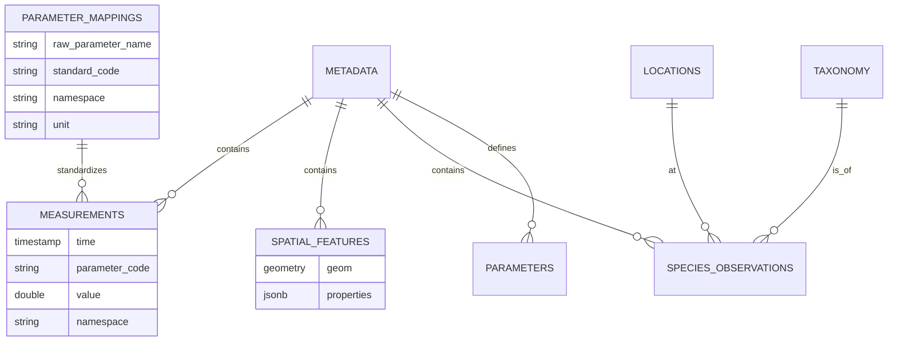

# Marine Data Platform - Database Schema Documentation

This document describes the database schema designed for the Tasmanian Climate & Marine Data Platform. The system utilizes **PostgreSQL 18+** with **TimescaleDB** (for time-series) and **PostGIS** (for spatial features).

## High-Level Architecture

The schema is organized around a central **Metadata** registry, to which all types of data are linked:
1.  **Time-Series Data**: High-frequency sensor readings (Hypertable).
2.  **Spatial Features**: Polygons, lines, and non-time-series geometries.
3.  **Biological Observations**: Species occurrences and taxonomy.
4.  **Parameter Mappings**: Standardized parameter name mappings (NEW!).

---

## 0. Parameter Standardization

### `parameter_mappings` ⭐ NEW

Maps raw parameter names from data files to standardized BODC/CF codes. This table **replaces** the previous `config_parameter_mapping.json` file, making parameter management dynamic and database-driven.

#### DDL

```sql
CREATE TABLE parameter_mappings (
    id SERIAL PRIMARY KEY,
    raw_parameter_name TEXT UNIQUE NOT NULL,
    standard_code TEXT NOT NULL,
    namespace TEXT NOT NULL CHECK (namespace IN ('bodc', 'cf', 'custom')),
    unit TEXT NOT NULL,
    description TEXT,
    source TEXT DEFAULT 'system',  -- 'system' or 'user'
    created_at TIMESTAMP DEFAULT NOW(),
    updated_at TIMESTAMP DEFAULT NOW()
);

CREATE INDEX idx_param_mappings_raw ON parameter_mappings(raw_parameter_name);
CREATE INDEX idx_param_mappings_code ON parameter_mappings(standard_code);
CREATE INDEX idx_param_mappings_namespace ON parameter_mappings(namespace);
```

#### Key Fields

- **`raw_parameter_name`**: The original column name from CSV/NetCDF files (e.g., `"TEMPERATURE"`, `"SEA_WATER_TEMP"`)
- **`standard_code`**: Standardized code used in `measurements` table (e.g., `"TEMP"`, `"PSAL"`)
- **`namespace`**: 
  - `bodc` = British Oceanographic Data Centre P01 codes
  - `cf` = Climate & Forecast convention standard names
  - `custom` = User-defined or unmapped parameters
- **`unit`**: Physical unit (e.g., `"Degrees Celsius"`, `"PSS-78"`)
- **`source`**: 
  - `system` = Pre-populated by `init.sql`
  - `user` = Added manually via SQL or web UI

#### Example Data

| raw_parameter_name | standard_code | namespace | unit | description |
|--------------------|---------------|-----------|------|-------------|
| TEMP | TEMP | bodc | Degrees Celsius | Sea water temperature |
| TEMPERATURE | TEMP | bodc | Degrees Celsius | Sea water temperature |
| SEA_WATER_TEMPERATURE | TEMP | cf | Degrees Celsius | CF standard name |
| CPHL | CPHL | bodc | mg/m3 | Chlorophyll-a concentration |
| CHLOROPHYLL_A | CPHL | bodc | mg/m3 | Chlorophyll-a |
| PSAL | PSAL | bodc | PSS-78 | Practical salinity |

#### Usage in ETL

The ETL script `populate_measurements_v2.py` queries this table to normalize parameter names:

```python
# ETL logic (simplified)
raw_name = csv_column_name.upper()  # "TEMPERATURE"
mapping = db.query("SELECT * FROM parameter_mappings WHERE raw_parameter_name = %s", [raw_name])
if mapping:
    standard_code = mapping['standard_code']  # "TEMP"
    namespace = mapping['namespace']          # "bodc"
    unit = mapping['unit']                    # "Degrees Celsius"
else:
    # Fallback to custom namespace
    standard_code = raw_name
    namespace = 'custom'
```

#### Adding Custom Mappings

```sql
-- Add a new parameter mapping
INSERT INTO parameter_mappings (raw_parameter_name, standard_code, namespace, unit, source)
VALUES ('MY_CUSTOM_TEMP', 'TEMP', 'custom', 'Degrees Celsius', 'user');

-- View all mappings
SELECT raw_parameter_name, standard_code, namespace, unit 
FROM parameter_mappings 
ORDER BY namespace, standard_code;

-- Find all temperature variants
SELECT * FROM parameter_mappings WHERE standard_code = 'TEMP';
```

---

## 1. Core Registry

### `metadata`
The central table for all datasets. Every file or distinct dataset ingested has an entry here.

#### DDL

```sql
CREATE TABLE metadata (
    id SERIAL PRIMARY KEY,
    uuid TEXT UNIQUE NOT NULL,
    parent_uuid TEXT,
    title TEXT NOT NULL,
    abstract TEXT,
    credit TEXT,
    status TEXT,
    topic_category TEXT,
    metadata_creation_date TIMESTAMP,
    metadata_revision_date TIMESTAMP,
    citation_date TIMESTAMP,
    language TEXT DEFAULT 'eng',
    character_set TEXT DEFAULT 'utf8',
    west DECIMAL(10,6),
    east DECIMAL(10,6),
    south DECIMAL(10,6),
    north DECIMAL(10,6),
    time_start DATE,
    time_end DATE,
    vertical_min DECIMAL(6,2),
    vertical_max DECIMAL(6,2),
    vertical_crs TEXT,
    lineage TEXT,
    supplemental_info TEXT,
    use_limitation TEXT,
    license_url TEXT,
    distribution_wfs_url TEXT,
    distribution_wms_url TEXT,
    distribution_portal_url TEXT,
    distribution_publication_url TEXT,
    dataset_name TEXT,
    dataset_path TEXT,
    extracted_at TIMESTAMP DEFAULT CURRENT_TIMESTAMP,
    date_created DATE,
    extent_geom GEOMETRY(POLYGON, 4326),
    bbox_envelope BOX2D GENERATED ALWAYS AS (BOX2D(extent_geom)) STORED
);
```

#### Key Fields

*   **`id`** (PK): Internal integer ID used for all foreign keys (performance).
*   **`uuid`**: The AODN/IMOS UUID from the original ISO 19115 XML.
*   **`extent_geom`**: A PostGIS POLYGON representing the bounding box of the entire dataset. Used for "Find datasets in this area" queries.
*   **`dataset_path`**: Relative path to the source folder/file on disk.

### `parameters` (One-to-Many with Metadata)
Describes specific variables available in a dataset (e.g., "Sea Surface Temperature").

#### DDL

```sql
CREATE TABLE parameters (
    id SERIAL PRIMARY KEY,
    metadata_id INTEGER REFERENCES metadata(id) ON DELETE CASCADE,
    uuid TEXT NOT NULL REFERENCES metadata(uuid) ON DELETE CASCADE,
    parameter_code TEXT NOT NULL,
    parameter_label TEXT,
    standard_name TEXT,
    aodn_parameter_uri TEXT,
    unit_name TEXT,
    unit_uri TEXT,
    content_type TEXT DEFAULT 'physicalMeasurement',
    is_depth BOOLEAN DEFAULT FALSE,
    temporal_start TIMESTAMP,
    temporal_end TIMESTAMP,
    vertical_min NUMERIC(6,2),
    vertical_max NUMERIC(6,2),
    created_at TIMESTAMP DEFAULT NOW(),
    imos_parameter_uri TEXT REFERENCES imos_vocab_parameters(uri),
    imos_unit_uri TEXT REFERENCES imos_vocab_units(uri),
    UNIQUE(uuid, parameter_code)
);
```

#### Key Fields

*   **`parameter_code`**: Critical linking field. Matches `parameter_code` in the `measurements` table.
*   **`aodn_parameter_uri`**: Link to the controlled vocabulary definition.

---

## 2. Time-Series Data (TimescaleDB)

### `measurements`
A **Hypertable** partitioned by `time`. Stores physical and chemical sensor data.

#### DDL

```sql
CREATE TABLE measurements (
    time TIMESTAMPTZ NOT NULL,
    data_id BIGSERIAL PRIMARY KEY,
    uuid TEXT REFERENCES metadata(uuid) ON DELETE CASCADE,
    parameter_code TEXT NOT NULL,
    namespace TEXT NOT NULL DEFAULT 'custom',
    value DOUBLE PRECISION NOT NULL,
    uom TEXT NOT NULL,
    uncertainty DOUBLE PRECISION,
    depth_m NUMERIC,
    location_id BIGINT REFERENCES locations(id),
    metadata_id INTEGER REFERENCES metadata(id),
    quality_flag SMALLINT DEFAULT 1
);

-- Convert to hypertable
SELECT create_hypertable('measurements', by_range('time'));

-- Add compression
SELECT add_compression_policy('measurements', INTERVAL '7 days');
```

#### Key Fields

*   **`time`**: Timestamp of observation.
*   **`parameter_code`**: The variable being measured (e.g., `TEMP`, `PSAL`, `CPHL`). Links to `parameter_mappings.standard_code`.
*   **`value`**: Numeric value of the measurement.
*   **`uom`**: Unit of measure (e.g., "Degrees Celsius").
*   **`namespace`**: **[Key Field]**
    *   `bodc`: Standardized code (British Oceanographic Data Centre). Use for robust queries.
    *   `custom`: Raw variable name from a file if no standard mapping existed.
    *   `cf`: Climate and Forecast standard name.
*   **`quality_flag`**: Integer (1=Good, 4=Bad/Fail). Always filter by `quality_flag = 1` for analysis.
*   **`metadata_id`**: FK to `metadata`.

> **Note**: This table is optimized for aggregations (daily/hourly means) via TimescaleDB Continuous Aggregates (`measurements_1h`, `measurements_1d`).

---

## 3. Spatial Data (PostGIS)

### `spatial_features`
Stores non-time-series geometries, such as Seagrass extent polygons or survey tracks.

#### DDL

```sql
CREATE TABLE spatial_features (
    id SERIAL PRIMARY KEY,
    metadata_id INTEGER REFERENCES metadata(id),
    uuid UUID,
    geom GEOMETRY(Geometry, 4326),
    properties JSONB
);

CREATE INDEX spatial_features_geom_idx ON spatial_features USING GIST (geom);
```

#### Key Fields

*   **`geom`**: PostGIS Geometry (Polygon, MultiPolygon, or LineString). SRID 4326.
*   **`properties`**: **[Key Field] JSONB** column containing all feature attributes (e.g., `{"density": "High", "area_ha": 50}`). This allows schema-less storage of diverse shapefile attributes.
*   **`metadata_id`**: FK to `metadata`.

---

## 4. Biological Data

Designed for species abundance and occurrence data.

### `taxonomy`
A normalized registry of species.

#### DDL

```sql
CREATE TABLE taxonomy (
    id SERIAL PRIMARY KEY,
    species_name TEXT UNIQUE NOT NULL,
    common_name TEXT,
    family TEXT,
    phylum TEXT,
    class TEXT,
    "order" TEXT,
    genus TEXT,
    authority TEXT
);
```

#### Key Fields

*   **`species_name`**: Scientific name (Unique).
*   **`common_name`**: Vernacular name.
*   **`family`, `phylum`, `class`**: Taxonomic hierarchy.

### `locations`
Distinct survey sites extracted from data files.

#### DDL

```sql
CREATE TABLE locations (
    id SERIAL PRIMARY KEY,
    location_name text,
    location_type text,
    location_geom geometry(Point,4326),
    longitude double precision,
    latitude double precision,
    description text,
    created_at timestamp without time zone DEFAULT now(),
    UNIQUE (latitude, longitude)
);

CREATE INDEX idx_locations_geom ON locations USING gist (location_geom);
```

#### Key Fields

*   **`location_name`**: Site code or name.
*   **`location_geom`**: Point geometry of the site.
*   **`latitude`, `longitude`**: Cached coordinates.

### `species_observations`
The core fact table for biology.

#### DDL

```sql
CREATE TABLE species_observations (
    id SERIAL PRIMARY KEY,
    metadata_id INTEGER REFERENCES metadata(id),
    location_id INTEGER REFERENCES locations(id),
    taxonomy_id INTEGER REFERENCES taxonomy(id),
    observation_date TIMESTAMP,
    count_value NUMERIC,
    count_category TEXT,
    depth_m NUMERIC,
    sex TEXT,
    size_class TEXT,
    method TEXT,
    notes TEXT,
    geom GEOMETRY(Point, 4326)
);

CREATE INDEX idx_species_obs_geom ON species_observations USING GIST(geom);
```

#### Key Fields

*   **`taxonomy_id`**: FK to `taxonomy`.
*   **`location_id`**: FK to `locations`.
*   **`count_value`**: Numeric abundance (if available).
*   **`count_category`**: Text description if count is a range (e.g., "DOC" - Dominant).
*   **`geom`**: **[Key Field]** Denormalized Point geometry. While redundant with `locations`, storing it here allows for faster heatmap generation and spatial filtering without joins.

---

## Key Relationships Diagram



---

## Continuous Aggregates (TimescaleDB)

Pre-computed rollups for Grafana dashboard performance.

### `measurements_1h`

Hourly aggregates of measurements.

```sql
CREATE MATERIALIZED VIEW measurements_1h
WITH (timescaledb.continuous) AS
SELECT time_bucket('1 hour', time) AS bucket,
       parameter_code, namespace, location_id, metadata_id,
       AVG(value) AS avg_value, 
       STDDEV(value) AS stddev_value,
       COUNT(*) AS count,
       MIN(quality_flag) AS min_quality
FROM measurements 
GROUP BY bucket, parameter_code, namespace, location_id, metadata_id;
```

### `measurements_1d`

Daily aggregates of measurements.

```sql
CREATE MATERIALIZED VIEW measurements_1d
WITH (timescaledb.continuous) AS
SELECT time_bucket('1 day', time) AS bucket,
       parameter_code, namespace, location_id,
       AVG(value) AS avg_value, 
       STDDEV(value) AS stddev_value,
       COUNT(*) AS count
FROM measurements 
GROUP BY bucket, parameter_code, namespace, location_id;
```

---

## Views

### `measurements_with_metadata`

Grafana-friendly view joining measurements with dataset metadata.

```sql
CREATE VIEW measurements_with_metadata AS
SELECT 
    m.time, m.data_id, m.parameter_code, m.namespace, m.value, m.uom,
    m.uncertainty, m.depth_m, m.location_id, m.quality_flag,
    md.title AS dataset_title,
    md.dataset_name,
    p.parameter_label,
    p.unit_name,
    md.extent_geom
FROM measurements m
LEFT JOIN metadata md ON m.metadata_id = md.id
LEFT JOIN parameters p ON md.id = p.metadata_id AND m.parameter_code = p.parameter_code;
```

### `datasets_by_parameter`

Spatial view showing which datasets contain specific parameters.

```sql
CREATE VIEW datasets_by_parameter AS
SELECT 
    p.parameter_code,
    p.parameter_label,
    p.aodn_parameter_uri,
    COUNT(DISTINCT md.id) AS dataset_count,
    ST_Union(md.extent_geom) AS parameter_extent,
    ARRAY_AGG(DISTINCT md.dataset_name) AS datasets
FROM parameters p
JOIN metadata md ON p.metadata_id = md.id
GROUP BY p.parameter_code, p.parameter_label, p.aodn_parameter_uri;
```

---

## Performance Features

### Indexes

- **GIST indexes** on all geometry columns for spatial queries
- **BRIN indexes** on `measurements.time` for efficient time-range scans
- **GIN indexes** on `parameter_code` for text search
- **B-tree indexes** on all foreign keys and commonly filtered columns

### Compression

- **TimescaleDB compression** on `measurements` table after 7 days
- Expected **90% space savings** on compressed data

### Partitioning

- `measurements` is a **hypertable** automatically partitioned by time
- Query performance optimized for time-range filters (Grafana dashboards)

---

## Common Queries

### Find all datasets with chlorophyll data

```sql
SELECT DISTINCT md.title, md.dataset_name
FROM measurements m
JOIN metadata md ON m.metadata_id = md.id
WHERE m.parameter_code = 'CPHL' AND m.namespace = 'bodc';
```

### Get temperature time-series for specific location

```sql
SELECT time, value, uom, quality_flag
FROM measurements
WHERE parameter_code = 'TEMP' 
  AND namespace = 'bodc'
  AND location_id = 42
  AND time BETWEEN '2023-01-01' AND '2023-12-31'
  AND quality_flag = 1
ORDER BY time;
```

### Find species observed in bounding box

```sql
SELECT DISTINCT t.species_name, t.common_name, COUNT(*) as observations
FROM species_observations so
JOIN taxonomy t ON so.taxonomy_id = t.id
WHERE ST_Within(so.geom, ST_MakeEnvelope(147.0, -43.5, 148.0, -42.5, 4326))
GROUP BY t.species_name, t.common_name
ORDER BY observations DESC;
```

### Get parameter mapping variants

```sql
-- Find all ways to represent temperature
SELECT raw_parameter_name, standard_code, namespace, unit
FROM parameter_mappings
WHERE standard_code = 'TEMP'
ORDER BY namespace, raw_parameter_name;
```

---

## Schema Migration Notes

### Version History

- **v1.0** (2025-12-18): Initial schema with measurements, metadata, spatial features
- **v1.1** (2025-12-20): Added `parameter_mappings` table to replace JSON config

### Future Enhancements

- [ ] Automated metadata ingestion from ISO 19115 XML
- [ ] Web UI for parameter mapping management
- [ ] IMOS vocabulary table population from AODN API
- [ ] Real-time data ingestion pipeline (streaming)

---

## References

- **TimescaleDB Documentation**: https://docs.timescale.com/
- **PostGIS Documentation**: https://postgis.net/documentation/
- **BODC Parameter Vocabulary**: https://www.bodc.ac.uk/data/codes_and_formats/vocabulary_search/
- **CF Conventions**: https://cfconventions.org/
